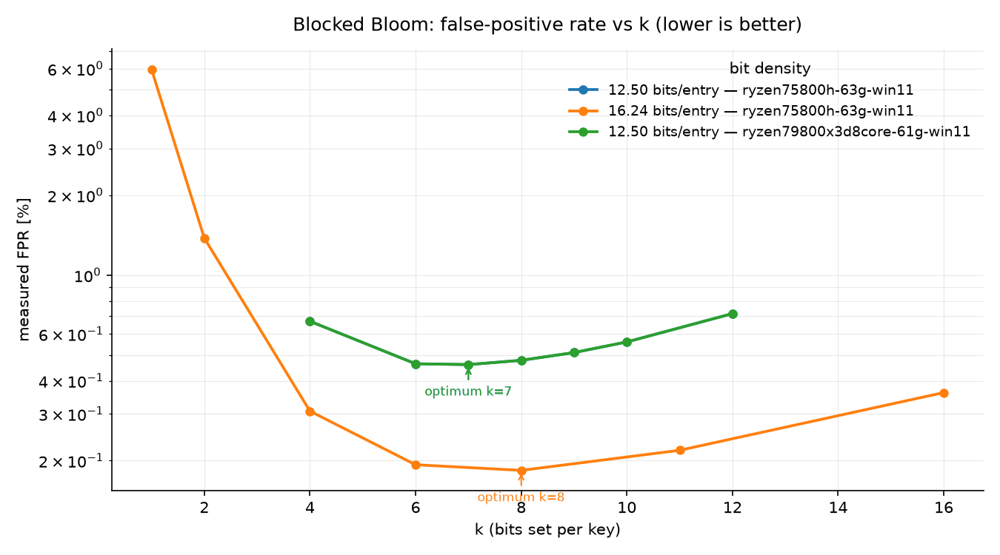
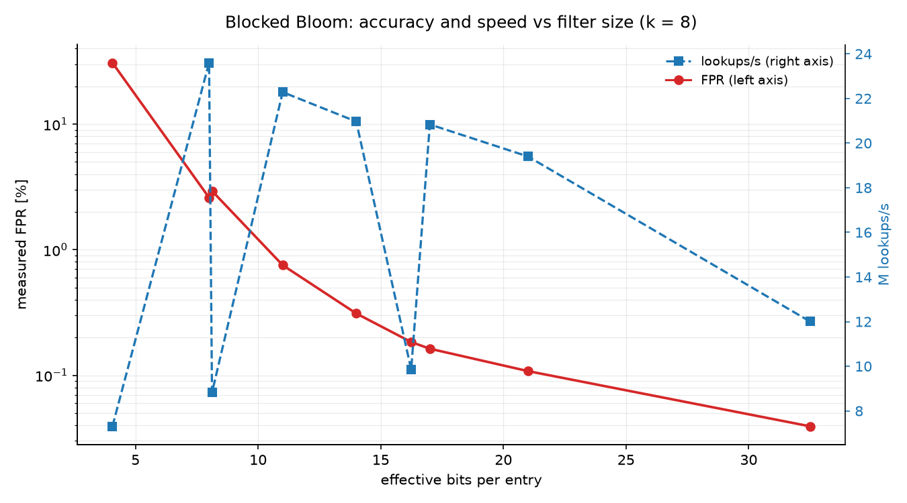
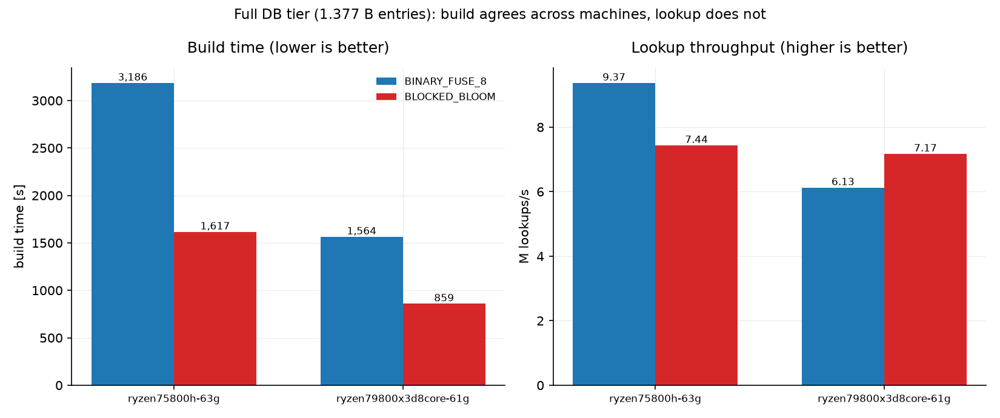
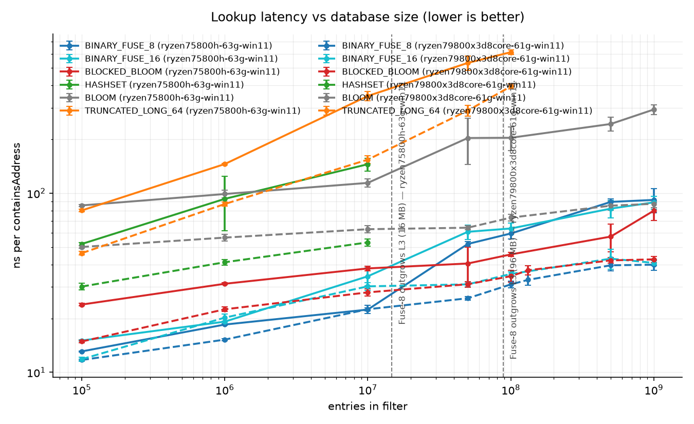
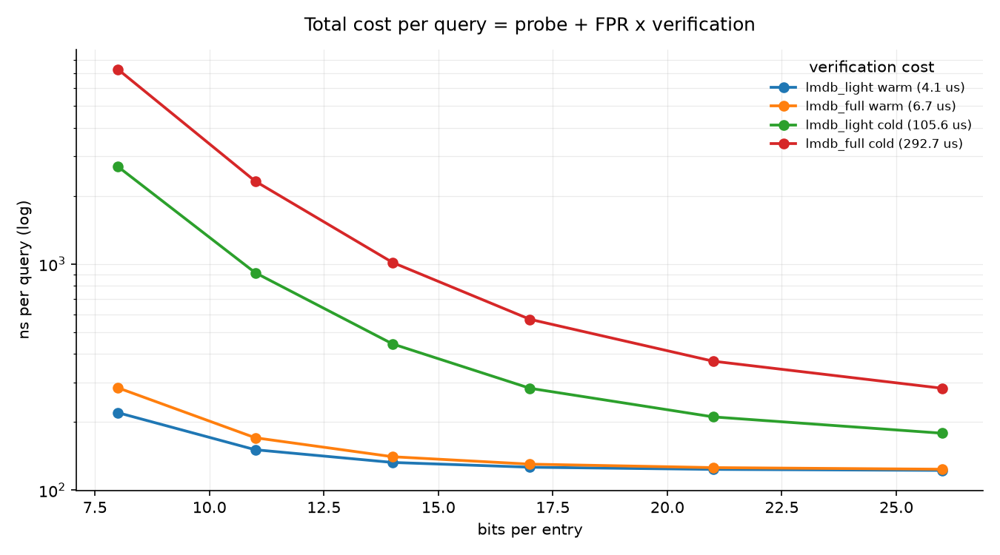
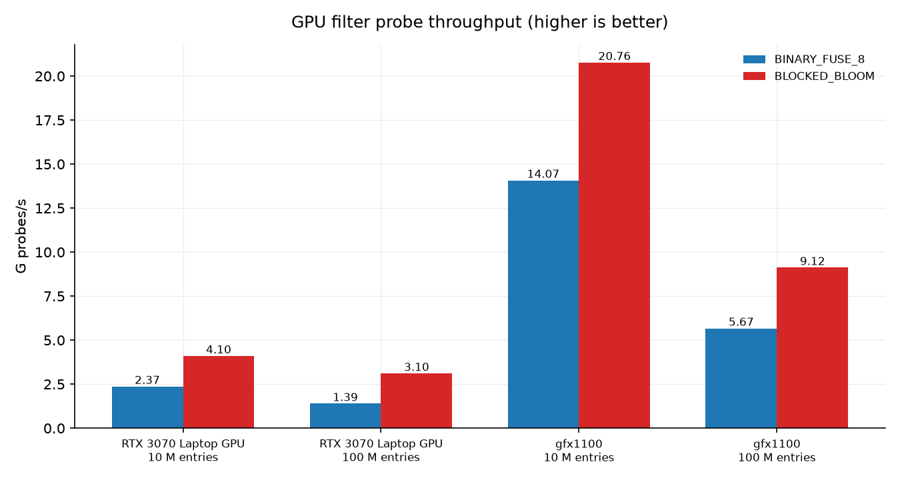

# Performance & Tuning — BitcoinAddressFinder GPU Key Generation

This is the deep, technical reference for getting maximum throughput out of the secp256k1 OpenCL
key-generation kernel: how the kernel works, which parameters matter, how to choose them per device,
the full optimization history with measured results, and how to benchmark correctly.

For the high-level, user-facing overview of the same knobs (`batchSizeInBits`, `keysPerWorkItem`,
the address-lookup backends), see the **README**. This document is for choosing *optimal* settings
and understanding *why* — it goes well beyond the defaults.

---

## 1. TL;DR — how to go fast

1. **Use a discrete GPU via OpenCL** for key generation; the CPU consumer checks addresses in
   parallel.
2. **Raise `keysPerWorkItem`.** The default is `1`, which is the *slowest* setting (a full `k·G`
   scalar multiplication per key). The optimum is **device-dependent and jointly tuned with
   `batchSizeInBits`** (see point 3). On an NVIDIA RTX 3070 Laptop the joint optimum is
   `keysPerWorkItem=2048` at `batchSizeInBits=24` (≈ **266 M keys/s** compact, reduced-radix on); on an
   AMD RX 7900 XTX it is `keysPerWorkItem=512` at `batch=24` on the **inlined** kernel
   (≈ **670 M keys/s**; the out-of-line/`noinline` kernel reaches only ≈ 188 M keys/s at that same arm —
   §9). Never leave it at `1`. Sweep both axes on your hardware (§4 "Joint (batch, kpwi) optimum").
3. **Maximize `batchSizeInBits` too** — a larger batch amortizes the per-launch overhead and lets a
   larger `keysPerWorkItem` amortize the one-time comb anchor. Push it up to **`24`** (the
   `MAXIMUM_CHUNK_ELEMENTS` cap) on an 8 GB+ GPU, scaling down for lower VRAM, while keeping ≳ 8 192
   work-items resident (`2^batchSizeInBits / keysPerWorkItem`). `batchSizeInBits` must be ≥
   `log2(keysPerWorkItem)`. The old fixed `batch=20, kpwi=128` is ~33% (NVIDIA) / ~2× (AMD) below the
   joint optimum.
4. **Benchmark with `GridSizeSweepBenchmark`** and read §6 first — laptop GPUs throttle, and naive
   A/B comparisons are misleading.

The kernel implements the same two techniques the fastest open-source key searchers (BitCrack,
VanitySearch) use: a **fixed-base comb** for the one-time `k·G`, and an **affine batched-addition
walk** for the consecutive keys. The optimization history that got here is in §5.

---

## 2. How GPU key generation works

`__kernel generateKeysKernel_grid(...)` — `src/main/resources/inc_ecc_secp256k1custom.cl`.

A Find-mode batch covers `2^batchSizeInBits` consecutive private keys. The CPU aligns a candidate
down to a `2^batchSizeInBits` boundary (`secretBase`) and submits it once; the kernel launches
`2^batchSizeInBits / keysPerWorkItem` work-items. Each work-item produces `K = keysPerWorkItem`
consecutive keys for scalars `secretBase | (g·K + m)`, `m = 0 … K-1`. The combine is an **OR** (valid
because `secretBase`'s low bits are cleared).

Per work-item:

1. **Anchor `P₀ = k₀·G`** — one fixed-base **comb** scalar multiplication (§5, Stage 2). `G` is a
   fixed point, so `k·G` is read from a precomputed table with ~0 doublings.
2. **Walk (keys 1 … K-1)** — every key is `Pₘ = P₀ + m·G`, computed directly in **affine** from the
   same anchor `P₀` (§5, Stage 1). The fixed multiples `m·G` come from a host-uploaded `i·G` table,
   and a single **Montgomery simultaneous inversion** covers a whole `KEYS_BATCH_INV`-sized
   sub-batch.
3. **Per key** — two hash160 chains (SHA-256 → RIPEMD-160 of the uncompressed and the compressed SEC
   public key), then a 108-byte output entry. In compact mode a GPU Binary Fuse 8 filter decides
   which entries are emitted (claimed with `atomic_add`, OpenCL 2.0+).

**Field layer** (`src/main/resources/copyfromhashcat/inc_ecc_secp256k1.cl`): 8×`u32` limbs;
schoolbook `mul_mod` + fast reduction for `p = 2²⁵⁶ − 2³² − 977`; `add_mod`; `sub_mod`; `inv_mod`
defaults to the **safegcd** path (§5, Stage 4 — a fixed-iteration libsecp256k1 `modinv32` port), with
the original binary extended-GCD (~256 data-dependent iterations, guards `a == 0`) kept behind
`-D USE_LEGACY_BINARY_GCD_INV_MOD` / `useSafeGcdInverse=false`.

### Why this is the hot path

Key generation dominates GPU runtime; address hashing + LMDB lookup run on the CPU consumer in
parallel. Within the kernel, **EC point arithmetic is the largest cost, but the two hash160 chains
are not far behind**: the stage-attribution suite (§6) measures **EC ≈ 57%, hashing ≈ 43%** on the
current kernel (RTX 3070, `keysPerWorkItem=128`). (An earlier back-of-envelope estimate put hashing
at ~30%; the direct measurement corrected it upward — re-run the suite on your device, the split is
device-dependent.)

---

## 3. The parameters that matter

### `keysPerWorkItem` (the big lever)

How many consecutive keys each work-item generates. `1` ⇒ one full `k·G` per key (slow). Higher ⇒
the expensive anchor `P₀ = k₀·G` is amortized over `K-1` cheap affine-addition steps, until too few
work-items remain to keep the GPU's compute units busy — so there is a **per-device sweet spot**.

- Must be a power of two; `batchSizeInBits` must be divisible by it.
- Default `1` is **not** optimal for scanning.
- On an RTX 3070 Laptop the optimum is `128` at `batchSizeInBits=20` (§4 table; it rose from 64 to 128
  once Stage 2 made `P₀` cheap). Weaker/older GPUs peak lower; sweep to find it.
- Config field: `producerOpenCL.keysPerWorkItem` (`CProducerOpenCL.java`).

### `batchSizeInBits`

Log₂ of the per-launch work size; each launch produces `2^batchSizeInBits` candidate keys.

| `batchSizeInBits` | Keys per batch | Use case |
|---|---:|---|
| `0` | 1 | sequential / secrets-file mode (no batching) |
| `14` | 16,384 | per-CPU-producer batch |
| `18` | 262,144 | typical OpenCL device |
| `20`–`21` | 1M–2M | high-end OpenCL device |

Upper bound: `OpenClKernelConstants.BIT_COUNT_FOR_MAX_CHUNKS_ARRAY` (`= 24`, so per-batch result arrays
stay within Java's 32-bit array-length limit). Larger batches improve GPU occupancy and amortize launch overhead,
but cost more VRAM for the result buffer and more host readback per launch.

### `KEYS_BATCH_INV` (compile-time)

Sub-batch size for Montgomery's simultaneous inversion in the affine walk: `KEYS_BATCH_INV` points
share **one** `inv_mod` (plus a few multiplies per point) instead of one inverse each. It is a
`#define` in `inc_ecc_secp256k1custom.cl` (default **`16`**). Larger values amortize the inverse over
more keys but use more private scratch. It is **not** a runtime argument — it sizes fixed-length
private arrays, so changing it means editing the kernel (or prepending a `#define` to the program
source before `clBuildProgram`) and re-running. Re-sweep `keysPerWorkItem` after changing it.

**Measured (RTX 3070, kpwi=128 compact, order-controlled).** Larger batch is genuinely faster — the
extra inverse amortization beats the extra spill (`kernelMaxWorkGroupSize` stays 256 regardless, so
occupancy is *not* the limiter here; only spill grows):

| `KEYS_BATCH_INV` | 4 | **8 (old default)** | **16 (default)** | 32 | 64 |
|---|--:|--:|--:|--:|--:|
| ops/s (kpwi=128) | ~136 | ~147 | ~155 | ~161 | ~165 |
| private-mem spill (bytes/work-item) | 384 | 640 | 1152 | 2176 | 4224 |

The default was raised **8 → 16** (≈ +5%, modest spill, and it matches the example configs' `kpwi=16`).
`32`/`64` add a further ≈ +4% / +6% **only when `keysPerWorkItem` is large** — they are worth setting
for a high-kpwi deployment but waste scratch when kpwi is small (the arrays are always sized to
`KEYS_BATCH_INV`), so they are left as an opt-in tune rather than the default.

### Address-lookup backend (`addressLookupBackend`) and the GPU filter

Independent of the EC knobs above but performance-relevant: the `LMDB_ONLY` default keeps LMDB open
and exact; the in-RAM filters (`BLOOM`, `HASHSET`, `TRUNCATED_LONG_64`, `BINARY_FUSE_8/16`,
`BLOCKED_BLOOM`) trade RAM for lookup speed; `producerOpenCL.enableGpuFilter` runs a Binary Fuse 8
pre-filter on the GPU so only candidate hits are transferred over PCIe. See the README for the
user-facing comparison; the GPU filter's measured transfer saving (~2.2× at grid 19 on an RTX 3070)
is benchmarked by `GpuFuse8FilterBenchmark`.

#### Filter construction cost — why `BLOCKED_BLOOM` exists

Lookup latency is only half the story; at the largest database tier the **build** is the binding
constraint. Measured with `FilterMeasurementMain` (see §6) against the real Light DB
(132,288,304 entries) — build wall-clock, retained heap after a full GC, and 5 M random-non-member
probes, with zero false negatives across 20 k sampled real members in every row:

| Backend             | build time | retained RAM | B / entry | lookups/s | measured FPR |
|---------------------|-----------:|-------------:|----------:|----------:|-------------:|
| `BLOCKED_BLOOM`     | **34.8 s** |    259.5 MiB |     2.057 |   11.54 M |    0.258 %   |
| `BINARY_FUSE_8`     |     68.8 s | **143.4 MiB**| **1.137** | **12.93 M**|   0.390 %   |
| `BINARY_FUSE_16`    |     70.6 s |    287.4 MiB |     2.278 |   12.30 M | **0.002 %**  |
| `TRUNCATED_LONG_64` |     41.9 s |   1082.2 MiB |     8.578 |    1.52 M |  0.000 %     |

At this tier the differences are minor in every column — blocked Bloom builds ~2× faster (single
streaming pass vs. peeling), costs ~1.8× the RAM of Fuse-8, looks up ~11 % slower.

##### `k` sweep — why the default is 8 (measured, not derived)

Same harness, Light DB, filter size pinned at 256 MiB (16.47 effective bits/entry):



<!-- BEGIN GENERATED:k_sweep_table -->
<!-- Generated by docs/measurements/plot.py — edit the CSV, not this block. -->


**8.00 bits/entry — ryzen75800h-63g-win11**

| `k` | 3 | 4 | 5 | 6 | 7 | 8 | 9 | 10 | 12 | 14 |
|---|--:|--:|--:|--:|--:|--:|--:|--:|--:|--:|
| FPR | 3.155 % | 2.594 % | 2.441 % | 2.510 % | 2.735 % | 3.115 % | 3.580 % | 4.234 % | 5.990 % | 8.479 % |

**11.00 bits/entry — ryzen75800h-63g-win11**

| `k` | 3 | 4 | 5 | 6 | 7 | 8 | 9 | 10 | 12 | 14 |
|---|--:|--:|--:|--:|--:|--:|--:|--:|--:|--:|
| FPR | 1.437 % | 0.997 % | 0.805 % | 0.758 % | 0.764 % | 0.806 % | 0.887 % | 0.996 % | 1.333 % | 1.807 % |

**12.50 bits/entry — ryzen75800h-63g-win11**

| `k` | 4 | 6 | 7 | 8 | 9 | 10 | 12 |
|---|--:|--:|--:|--:|--:|--:|--:|
| FPR | 0.670 % | 0.463 % | 0.460 % | 0.477 % | 0.511 % | 0.560 % | 0.716 % |

**14.00 bits/entry — ryzen75800h-63g-win11**

| `k` | 3 | 4 | 5 | 6 | 7 | 8 | 9 | 10 | 12 | 14 |
|---|--:|--:|--:|--:|--:|--:|--:|--:|--:|--:|
| FPR | 0.788 % | 0.476 % | 0.359 % | 0.312 % | 0.306 % | 0.310 % | 0.318 % | 0.347 % | 0.431 % | 0.557 % |

**16.24 bits/entry — ryzen75800h-63g-win11**

| `k` | 1 | 2 | 4 | 6 | 8 | 11 | 16 |
|---|--:|--:|--:|--:|--:|--:|--:|
| FPR | 5.964 % | 1.378 % | 0.307 % | 0.193 % | 0.184 % | 0.219 % | 0.361 % |

**17.00 bits/entry — ryzen75800h-63g-win11**

| `k` | 3 | 4 | 5 | 6 | 7 | 8 | 9 | 10 | 12 | 14 |
|---|--:|--:|--:|--:|--:|--:|--:|--:|--:|--:|
| FPR | 0.480 % | 0.267 % | 0.193 % | 0.165 % | 0.153 % | 0.156 % | 0.158 % | 0.168 % | 0.207 % | 0.247 % |

**21.00 bits/entry — ryzen75800h-63g-win11**

| `k` | 3 | 4 | 5 | 6 | 7 | 8 | 9 | 10 | 12 | 14 |
|---|--:|--:|--:|--:|--:|--:|--:|--:|--:|--:|
| FPR | 0.281 % | 0.146 % | 0.104 % | 0.089 % | 0.086 % | 0.086 % | 0.088 % | 0.096 % | 0.111 % | 0.125 % |

**26.00 bits/entry — ryzen75800h-63g-win11**

| `k` | 3 | 4 | 5 | 6 | 7 | 8 | 9 | 10 | 12 | 14 |
|---|--:|--:|--:|--:|--:|--:|--:|--:|--:|--:|
| FPR | 0.163 % | 0.083 % | 0.059 % | 0.057 % | 0.057 % | 0.056 % | 0.055 % | 0.060 % | 0.069 % | 0.077 % |

**11.00 bits/entry — ryzen79800x3d8core-61g-win11**

| `k` | 4 | 5 | 6 | 7 | 8 | 10 |
|---|--:|--:|--:|--:|--:|--:|
| FPR | 0.998 % | 0.811 % | 0.753 % | 0.759 % | 0.802 % | 0.993 % |

**12.50 bits/entry — ryzen79800x3d8core-61g-win11**

| `k` | 4 | 6 | 7 | 8 | 9 | 10 | 12 |
|---|--:|--:|--:|--:|--:|--:|--:|
| FPR | 0.670 % | 0.463 % | 0.460 % | 0.477 % | 0.511 % | 0.560 % | 0.716 % |

<!-- END GENERATED:k_sweep_table -->

FPR is **not monotone in `k`** — it bottoms at 8 and rises again as the shared 512-bit block saturates.
The blocked optimum sits *below* the unblocked textbook value `(m/n)·ln2 ≈ 11` because confining all
probes to one block adds per-block load variance, which penalises large `k`. `k = 1` degenerates to a
plain direct-addressed bitmap: fastest lookups in the table and its FPR matches closed-form
`1 − e^(−n/m)` = 5.97 % (measured 5.964 %), but ~1 query in 17 then falls through to LMDB, which costs
far more than the ~29 % probe saving.

**Stride parity bug (fixed).** The probe walk `bit_i = (x + i·y) mod 512` has period
`512 / gcd(y, 512)`. An unconstrained `y` makes 1 key in 512 place every probe on one bit (1 in 256 →
2 bits, 1 in 128 → 4). Forcing `y` odd guarantees distinct probes and measured **0.258 % → 0.184 %**
at identical size and `k`. Note the original theory-vs-measurement gap was *initially misattributed
entirely to this effect*; the corrected decomposition is unblocked ideal 0.052 % → blocking penalty
~0.184 % → stride degeneracy 0.258 %, i.e. the blocking penalty is the larger term.

##### Size sweep at `k = 8` — and why Fuse-8 survives



| size | B/entry | FPR | lookups/s |
|-----:|--------:|----:|----------:|
|  68 MiB | 0.537 | 30.82 % |  7.31 M |
| 132 MiB | 1.045 |  2.937 % |  8.82 M |
| 260 MiB | 2.059 |  0.184 % |  9.85 M |
| 516 MiB | 4.089 |  0.039 % | 12.00 M |

###### Size sweep at *matched* `k` — the trade-off has an interior optimum

The sweep above holds `k = 8` while size varies. Sweeping size with `k` tracked to it
(`k ≈ 0.55 × bits/entry`) answers a different and more practical question — what to configure —
and gives the opposite speed trend, because the rising `k` costs more probes than the rising
sparsity saves (`ryzen79800x3d8core-61g-win11`, 10 M PRNG entries, fastrange):

| bits/entry | `k` | size | FPR | lookups/s |
|--:|--:|--:|--:|--:|
| 8 | 4 | 9 MiB | 2.598 % | 23.60 M |
| 11 | 6 | 13 MiB | 0.753 % | 22.28 M |
| 14 | 8 | 16 MiB | 0.311 % | 20.97 M |
| 17 | 9 | 20 MiB | 0.163 % | 20.84 M |
| 21 | 12 | 25 MiB | 0.108 % | 19.40 M |

**Speed varies by 22 % across this range while FPR varies by 24×**, so the choice is dominated by
what a false positive costs. A false positive is an LMDB lookup that the filter was supposed to
prevent, so the figure of merit is `filter_ns + FPR × lmdb_ns`, not lookups/s:

| bits/entry | filter only | + FPR × 200 ns | + FPR × 2 µs |
|--:|--:|--:|--:|
| 8 | 42.4 ns | 47.6 | 94.3 |
| 11 | 44.9 ns | **46.4** | 59.9 |
| 14 | 47.7 ns | 48.3 | 53.9 |
| 17 | 48.0 ns | 48.3 | **51.3** |
| 21 | 51.5 ns | 51.8 | 53.7 |

So the optimum moves with the *database*, not the CPU: ~11 bits/entry when a miss is cheap (warm
page cache), ~14-17 when it costs microseconds (cold NVMe, the Full DB case). The shipped 11 is the
right default for the light tier; a Full-DB scan on cold storage would likely do better at 14.
Treat the second and third columns as a model, not a measurement — the LMDB miss costs are assumed,
not measured here, and closing that would need an end-to-end scan.

Larger filters look up **faster** at *fixed* `k`: `containsAddress` short-circuits on the first unset
bit, so a saturated filter runs more probes before answering "no" — speed tracks sparsity, not size.
At matched
footprint (1.045 vs 1.137 B/entry) Fuse-8's 0.390 % beats blocked Bloom's 2.937 % by ~7.5×, which is
the quantitative reason Fuse-8 was kept rather than superseded.

**Build memory matters, but it is not disqualifying — that was measured wrong once.** The Binary Fuse
peeling construction holds keys + counters + XOR accumulator + peeling queue + order/alone arrays
live simultaneously — ≈ 29 B/entry at peak, i.e. **≈ 42 GB of heap at the 1.377 B-entry Full DB**,
which competes with the OS page cache the 61 GB LMDB mmap wants on a ~64 GB host. This was
originally recorded as a hard failure ("thrashes and does not complete"). **An independent run on a
second 61.6 GB host refuted that: with `-Xmx48g` and a `PageCacheBuster` pass first, `BINARY_FUSE_8`
built the full 1.377 B-entry database in 1 564 s, no OOM.** The pressure is real but confined to the
*ingest* path — the read phase degraded to ~1.1 M/s with free RAM at 0.3 GB, while the peeling step
itself, the one presumed impossible, finished in 76 s at ~19 M/s. The blocked Bloom build by contrast
allocates the bit array once and streams — **peak build memory ≈ the filter itself** (2 GiB at the
Full DB tier) — which is why it builds in roughly half the wall-clock and without the memory cliff.

**`BLOCKED_BLOOM`'s only Full-DB edge is *build* speed — the lookup comparison at this tier does not
survive a second machine, so the recommendation is `BINARY_FUSE_8` on total cost.** Both backends have
now been measured on both hosts at the 1.377 B-entry tier, each arm preceded by a `PageCacheBuster`
pass and run at `-Xmx48g`:



| | 16 MB L3 host | | 96 MB L3 host | |
|---|--:|--:|--:|--:|
| | `BINARY_FUSE_8` | `BLOCKED_BLOOM` | `BINARY_FUSE_8` | `BLOCKED_BLOOM` |
| build | 3 186 s | **1 617 s** | 1 564 s | **859 s** |
| lookups/s | **9.37 M** | 7.44 M | 6.13 M | **7.17 M** |
| retained | **1 504 MiB** | 2 080 MiB | **1 504 MiB** | 2 080 MiB |
| FPR | **0.393 %** | 0.485 % | **0.393 %** | 0.485 % |

What holds on both machines, and is therefore what the recommendation rests on:

- **Blocked Bloom builds ~1.8–2.0× faster** (1.97× and 1.82×) — it streams the bit array once where
  peeling makes several passes over multi-GB auxiliary arrays.
- **Fuse-8 is 27 % smaller with a ~19 % better FPR**, and both figures are *bit-identical* across
  hosts (1 504.1 MiB / 1.145 B/entry / 0.003933), as is blocked Bloom's — a clean determinism check.

**What does not hold is the lookup comparison, and the disagreement is the finding.** The 16 MB host
makes Fuse-8 26 % faster; the 96 MB host makes blocked Bloom 17 % faster. That cannot be a cache
effect in the direction claimed: at 1.5–2 GB *neither* filter fits in *any* L3, so the blocked
layout's single-cache-line advantage should hold on both. It also contradicts this project's own JMH
sweep, which on the 16 MB host has blocked Bloom ahead at 100 M entries (45.5 vs 59.6 ns) — two
methods, one machine, opposite directions.

The explanation was the measurement, not the filters — **and the JMH sweep has now settled it.** The
single-shot figures come from `FilterMeasurementMain`'s probe loop, executed immediately after a
14–53 minute build that leaves the machine in very different memory states per arm, with no JIT
warmup discipline. Extending the storage-free, JMH-warmed `FilterLookupBenchmark` to 500 M and 1 B
entries on the 96 MB host puts the question to rest:

| entries | `BINARY_FUSE_8` | `BLOCKED_BLOOM` | `BINARY_FUSE_16` | `BLOOM` |
|--:|--:|--:|--:|--:|
| 500 M | **39.6 ± 2.8** | 42.1 ± 1.5 | 43.1 ± 5.6 | 85.2 ± 5.0 |
| 1 B | **39.9 ± 2.9** | 42.7 ± 1.7 | 40.8 ± 1.4 | 87.2 ± 4.1 |

Two things follow. First, **the single-shot "blocked Bloom +17 %" reading on this host does not
replicate** — the warmed instrument puts Fuse-8 nominally *ahead* at both sizes, so that column was
indeed an artefact of the instrument. Second, **there is no crossover on a 96 MB-L3 host even at
1 B entries.** Read the margin honestly, though: Fuse-8 leads by only ~6 %, and the intervals
overlap at both points, so the fair statement is *blocked Bloom is not faster here*, not *Fuse-8
wins*. Both curves are essentially flat from 500 M to 1 B (39.6 → 39.9 and 42.1 → 42.7), which is
the expected signature of a fully DRAM-bound regime where neither layout has any cache left to lose.

**The same sweep on the 16 MB host completes the picture — and inverts the answer, as the cache
story predicts:**

| entries | `BINARY_FUSE_8` | `BLOCKED_BLOOM` | `BINARY_FUSE_16` | `BLOOM` |
|--:|--:|--:|--:|--:|
| 500 M | 89.4 ± 3.7 | **57.2 ± 10.1** | 82.0 ± 9.3 | 243.3 ± 21.8 |
| 1 B | 91.7 ± 14.2 | **79.8 ± 9.5** | 88.8 ± 7.2 | 293.1 ± 18.6 |

Blocked Bloom leads by 36 % at 500 M and 13 % at 1 B here, against Fuse-8 leading by ~6 % on the
96 MB host — so the backend ranking at the Full DB tier genuinely flips with cache size, and the
claim that it does is now measured on both hosts rather than inferred from 100 M. The magnitude of
the cache effect is worth stating plainly: **the identical Fuse-8 array costs 91.7 ns on 16 MB of L3
and 39.9 ns on 96 MB — 2.3× from cache alone**, on otherwise comparable 8C/16T parts.

**One methodological result deserves recording: the single-shot loop reported the opposite winner on
_both_ hosts.** It claimed blocked Bloom +17 % where the warmed instrument finds Fuse-8 ahead, and
Fuse-8 +26 % where the warmed instrument finds blocked Bloom ahead. Two independent inversions is a
systematic artefact rather than noise, so **`filter_build.csv`'s `lookups_per_sec` column must not be
used to compare backends** — only its build-time, size and FPR columns are trustworthy. The column is
retained for provenance, not for conclusions.

**Consequence: at the ≈ 1 B+ tier on a large-cache host, any case for `BLOCKED_BLOOM` rests on
build time alone** — 1.8–2.0× faster to construct, reproduced on both machines — and not on lookup
speed, which is a wash or slightly against it. On the 16 MB host the cache argument still applies and
blocked Bloom wins on both counts — now measured at 500 M and 1 B, not extrapolated. The recommendation
is **`BINARY_FUSE_8` at every tier** (lower RAM, lower FPR, and it feeds the GPU pre-filter): its
one-time build cost amortises over the database's life. Reach for `BLOCKED_BLOOM` only when its build
advantage dominates — **rebuild-heavy or heap-constrained** builds — or on a small-L3 host where it is
also the faster lookup.

###### Build time is I/O, and free RAM is the lever (`MDB_NORDAHEAD`)

At the Full DB tier the build is bound by the LMDB walk, not the filter. Two measurements of the
*same* 1.377 B-entry build make the mechanism concrete:

| run | free RAM at start | build |
|---|--:|--:|
| RAM contended (after a 12 GB-heap JMH run) | ~2 GB | 1 869 s |
| cache emptied, ample headroom | 58 GB | 1 043 s |

Nearly 2× faster from the *colder* start — because the store is written in random hash160 order, so a
key-ordered cursor walk is physically scattered across the 61 GB file. With headroom, pages
accumulate; without it they are evicted before reuse and re-read. Measured mid-build in the contended
case: the NVMe ran 86 % busy at 332 MB/s while yielding only ~19 MB/s of useful entry data — ~17×
read amplification. **Free RAM, not cache warmth, is the variable that matters.**

`CLMDBConfigurationReadOnly.useNoReadAhead` opens the read-only env with `MDB_NORDAHEAD`, asking the
OS not to prefetch neighbours that will be evicted before their turn.

> **Platform limitation — the flag does nothing on Windows.** LMDB does not implement `MDB_NORDAHEAD`
> on Windows; lmdbjava's own javadoc states *"Don't do readahead (no effect on Windows) … The option
> is not implemented on Windows."* It is a POSIX-only lever (there it maps to a `madvise`-style hint).

A cold-cache A/B was nevertheless run on Windows, each arm preceded by a 46 GiB `PageCacheBuster`
pass, before that limitation was checked:

| arm | build | free RAM at start | FPR | retained |
|---|--:|--:|--:|--:|
| baseline | 1 042.8 s | 35.4 GB | 0.004847 | 2052.1 MiB |
| `MDB_NORDAHEAD` (no-op here) | 965.8 s | 28.7 GB | 0.004847 | 2052.1 MiB |

**That 7.4 % difference is not an effect of the flag — it is run-to-run variance**, since both arms
executed identical code paths. Retained size and FPR being bit-identical is consistent with exactly
that. The result is retained here for one genuinely useful reason: it calibrates the **noise floor of
this measurement at roughly 7-8 % for n = 1**, so any future full-DB build effect smaller than that
cannot be distinguished from noise without repeats.

**`MDB_NORDAHEAD` therefore remains unvalidated in this project.** Settling it requires running the
same A/B on Linux, where the flag is actually implemented — ideally with alternating arm order,
matched free RAM, and enough repeats to beat the ~8 % noise floor established above. The default
stays `false`, which is also correct on POSIX whenever the database fits in RAM, since read-ahead is
a genuine win in that case. The two were measured against
each other precisely to decide whether one could be removed — they cannot, their optimal domains are
disjoint, so `BLOCKED_BLOOM` was added rather than substituted.

##### Lookup latency vs database size — the storage-free sweep

`FilterLookupBenchmark` (JMH) removes LMDB from the comparison entirely: addresses come from a
seeded PRNG (`PrngAddressIterable`), so there is no page-cache behaviour, no read amplification, and
no dependence on what the OS happened to have cached — only the filter is measured. It sweeps the
entry count, which is the axis that decides the ranking. Average ns per `containsAddress` on
non-member probes:



<!-- BEGIN GENERATED:filter_lookup_table -->
<!-- Generated by docs/measurements/plot.py — edit the CSV, not this block. -->


**ryzen75800h-63g-win11**

| Backend | 100 K | 1 M | 10 M | 50 M | 100 M | 500 M | 1000 M |
|---|--:|--:|--:|--:|--:|--:|--:|
| `BINARY_FUSE_8` | 13.1 | 18.5 | 31.2 | 52.1 | 59.3 | 89.4 | 77.7 |
| `BINARY_FUSE_16` | 15.1 | 19.2 | 36.5 | 60.9 | 65.8 | 82.0 | 82.8 |
| `BLOCKED_BLOOM` | 23.9 | 33.2 | 39.8 | 40.5 | 50.2 | 61.4 | 72.7 |
| `HASHSET` | 52.1 | 92.9 | 145.1 | — | — | — | — |
| `BLOOM` | 85.4 | 98.9 | 114.1 | 203.2 | 203.8 | 243.3 | 293.1 |
| `TRUNCATED_LONG_64` | 80.1 | 145.4 | 337.3 | 533.3 | 635.5 | — | 1043.6 |

**ryzen79800x3d8core-61g-win11**

| Backend | 100 K | 1 M | 10 M | 50 M | 100 M | 132 M | 500 M | 1000 M |
|---|--:|--:|--:|--:|--:|--:|--:|--:|
| `BINARY_FUSE_8` | 11.7 | 15.2 | 22.1 | 25.9 | 31.0 | 32.8 | 39.6 | 39.4 |
| `BINARY_FUSE_16` | 11.8 | 20.2 | 22.2 | 31.0 | 35.0 | — | 43.1 | 40.0 |
| `BLOCKED_BLOOM` | 17.9 | 22.3 | 27.7 | 29.1 | 34.5 | 36.3 | 42.4 | 44.3 |
| `HASHSET` | 30.1 | 41.2 | 53.1 | — | — | — | — | — |
| `BLOOM` | 50.1 | 56.5 | 62.9 | 64.1 | 73.0 | — | 85.2 | 87.2 |
| `TRUNCATED_LONG_64` | 46.2 | 87.0 | 146.4 | 289.2 | 398.5 | — | — | 779.3 |

<!-- END GENERATED:filter_lookup_table -->

- **The crossover between `BINARY_FUSE_8` and `BLOCKED_BLOOM` lies between 10 M and 50 M entries —
  on a 16 MB-L3 machine.** Below it Fuse-8 wins by ~1.7×, above it blocked Bloom wins by ~1.3×. The
  step sizes show why: from
  10 M to 50 M Fuse-8 degrades 2.3× (22.4 → 52.1 ns) while blocked Bloom moves 1.07× (38.0 → 40.5 ns).
  That is where the Fuse-8 array outgrows L3 (~11 MB at 10 M, ~57 MB at 50 M); once neither filter is
  cache-resident a fuse lookup costs **three** scattered misses against blocked Bloom's **one**, since
  all `k` probes share a 512-bit block. Blocked Bloom is the flattest structure measured (1.9× from
  100 K to 100 M vs Fuse-8's 4.5×). On that machine both published database tiers sit above the
  crossover — **but that placement is a property of the cache, not of the filters**, see below.
- **The crossover is set by L3 size, and moves with it — confirmed on second hardware.** The
  prediction that a larger cache pushes the crossover right was tested on `ryzen79800x3d8core-61g-win11`
  (3D V-Cache, 96 MB L3 — six times the reference machine, otherwise comparable 8C/16T). It holds:
  Fuse-8 is still ahead of blocked Bloom at **both** 50 M and 100 M there, so the crossover has not
  occurred anywhere in the measured range, whereas the reference machine had already flipped by 50 M.
  The mechanism is visible in the margins: Fuse-8's lead shrinks between 50 M and 100 M, which is
  exactly where its array (~1.14 B/entry) grows past 96 MB — so the crossover should lie not far
  beyond 100 M rather than far away. Practical consequence: **the "blocked Bloom wins at production
  scale" conclusion is machine-specific — but only for the tiers where both filters can actually be
  built.** Two different resources gate the choice, and conflating them inverts the recommendation:

  | resource | decides | scale at which it binds |
  |---|---|---|
  | **RAM** | how *painful* the `BINARY_FUSE_8` build is (peeling peaks at ~29 B/entry) | ~42 GB at the 1.377 B-entry Full DB — slow, but survivable at 61.6 GB |
  | **L3 cache** | which filter is *faster* | crossover at ~15 M entries per 16 MB of L3 |

  At the **Light DB** tier (132 M) both are buildable and the choice is cache-dependent — a
  large-cache host should prefer Fuse-8, and that is measured at the exact tier size, not
  extrapolated: 32.8 ± 2.1 ns vs 37.1 ± 2.1 ns on the 96 MB-L3 host. The margin is narrow (~12 %,
  intervals barely disjoint), so treat it as a lean, not a landslide.

  At the **Full DB** tier (1.377 B) an earlier edition claimed the question does not arise because
  Fuse-8 cannot be constructed at all. **That was wrong, and an independent run disproved it** — see
  the build comparison above. Both filters build; blocked Bloom wins on build time there (~1.8-2.0x
  faster lookups, ~1.8× faster build), because at ~1.5 GB the fuse array is far past any L3. So
  **`BINARY_FUSE_8` is the Full DB recommendation on total cost** — smaller (1.145 vs 1.583 B/entry),
  lower FPR (0.393 % vs 0.485 %), and its one-time slower build amortises over the database's life.
  `BLOCKED_BLOOM` wins build time there (and lookup on a small-L3 host), so it is the pick for
  rebuild-heavy or heap-constrained builds — a throughput/build result, not a feasibility one.

  Pick against *both* properties of the machine that will run the scan: cache decides which is
  faster, RAM decides how much the fuse build will hurt — not a single published table.
- **`TRUNCATED_LONG_64` degrades worst** (7.6×, ending at 612 ns) — ~log₂(n/256) dependent cache
  misses per query. The "near-`HASHSET` latency" claim in older docs is a small-database result.
- **`BLOOM` remains slowest** even after being retuned to key on 8 bytes; the residue is structural in
  Guava (k scattered probes, atomic bit array).

> **Measurement history — this table was wrong twice before it was right.** An earlier edition put the
> crossover *at* 10 M based on a Fuse-8 data point of 37.2 ± 50.3 ns, an error bar wider than the
> score. Re-measuring with five iterations gave 22.4 ± 0.4 ns, which then suggested there was *no*
> crossover at all — an equally premature conclusion, drawn from data that stopped at 10 M. Extending
> the sweep to 50 M and 100 M produced the result above. The lesson is recorded rather than tidied
> away: a sweep that stops short of the interesting regime is as misleading as a noisy point inside
> it.

##### Cache-hot vs cache-cold — do not extrapolate the JMH microbenchmark

`AddressLookupBenchmark` (2048 entries, everything L1-resident) measures `BLOCKED_BLOOM` at ~30 ns/op
against Fuse-8's ~19 ns/op: with no cache misses the comparison reduces to instruction count, and
`k = 8` dependent bit-probes lose to 3 array reads. That ordering **inverts in significance** at real
sizes — on the 132 M-entry Light DB the gap narrows to 11.54 M vs 12.93 M lookups/s (≈ 87 vs 77 ns),
because the cost becomes memory latency and blocked Bloom's `k` probes are confined to a **single
512-bit (64-byte) block** — one cache line, one coalesced transaction — while a fuse lookup makes
three scattered reads. Always size expectations from the real-database table, not the JMH row.

---

## 4. Benchmarked tuning — `keysPerWorkItem` sweep

NVIDIA RTX 3070 Laptop GPU, OpenCL 3.0 CUDA, `batchSizeInBits = 20`, single-session re-sweep **after
Stage 4** (safegcd); candidates/s = JMH ops/s × `2^batchSizeInBits`. Two modes shown — full transfer
(`GridSizeSweepBenchmark`, every result read back) and compact (`GpuFuse8FilterBenchmark -p
gpuFilter=true`, only filter hits read back, i.e. the real GPU-filter fast path):

> **Note — this table predates the reduced-radix default (Stage 5) + refinement (b).** Its absolute
> compact peak (≈ 138 M keys/s at kpwi=128) is therefore ~30% below current code, which reaches ≈ 200 M
> keys/s at the *same* `batch=20, kpwi=128` (and ≈ 266 M at the joint `batch=24, kpwi=2048` optimum — see
> the subsection below). Per §6 this table illustrates the **shape and peak *location*** (which are
> unchanged), not current absolutes.

| `keysPerWorkItem` | 1 | 8 | 16 | 32 | 64 | **128** | 256 |
|---|--:|--:|--:|--:|--:|--:|--:|
| M keys/s — full transfer | 6.4 | 26 | 30 | 34 | 41 | **43** | 36 |
| M keys/s — compact (fast path) | 7.0 | 47 | 69 | 96 | 124 | **138** | 93 |
| vs. `=1` (compact) | 1.0× | 6.7× | 9.8× | 13.7× | 17.7× | **19.8× (peak)** | 13.3× |

Notes:

- The default `keysPerWorkItem = 1` pays a full scalar multiplication per key and is far from
  optimal — up to ~20× off the peak in compact mode.
- **`keysPerWorkItem = 128` is the peak *only at this fixed `batchSizeInBits = 20`.*** It is **not**
  the global optimum: with the batch size also free, the joint `(batchSizeInBits, keysPerWorkItem)`
  optimum is much higher and ~**+33%** faster — see "**Joint (batch, kpwi) optimum**" below. Within the
  batch=20 row the peak does sit at 128 (rise to 128, fall at 256), confirmed in both modes.
- **Compact ≫ full transfer** because the fast path skips the ~113 MB readback; this is why the
  numbers here are much higher than the pre-Stage-3/4 editions of this table (those were full transfer
  in an unknown thermal window — per §6, treat absolute numbers across sessions as non-comparable; the
  robust, reproducible result is the *shape and the peak location*).
- Beyond this row's peak, throughput drops because too few work-items remain. **Correction:** an earlier
  edition claimed `2^20 / 128 = 8192` work-items "fills this 40-SM GPU" — it does **not**. 8192 work-items
  is only ~32 work-groups (≤256 each) for 40 SMs, i.e. **under one group per SM** — the GPU is
  *under-occupied* at batch=20. Real saturation needs several groups per SM (`batchSizeInBits ≈ 22-24`);
  see the joint-optimum subsection.
- The sweet spot is **device-dependent** — sweep on your own hardware with the §6 recipe. The peak
  also depends on `batchSizeInBits` via the work-item count `2^batchSizeInBits / keysPerWorkItem` — at
  the smaller `batchSizeInBits = 18` the work-item-count analog of this peak is `keysPerWorkItem = 32`
  (also 8192 work-items), and the example configs use `16` as a safe cross-device default. The curve
  is flatter than pre-comb, so even a moderate value (16–32) captures most of the gain on a wide range
  of GPUs.

Use `{"command":"OpenCLInfo"}` to confirm a device is present and pick `platformIndex` /
`deviceIndex` before benchmarking.

### Joint (batchSizeInBits, keysPerWorkItem) optimum — the real sweet spot (≈ +33%)

The `keysPerWorkItem` table above fixes `batchSizeInBits = 20`. **That batch size under-occupies the
RTX 3070, and 128 is not the global optimum.** A 2-D sweep over both axes (compact, reduced-radix on,
RTX 3070 Laptop, candidates/s = JMH ops/s × `2^batchSizeInBits`) finds a far higher peak:

| M keys/s | kpwi=128 | kpwi=256 | kpwi=512 | kpwi=1024 | kpwi=2048 |
|---|--:|--:|--:|--:|--:|
| **batch=20** | 200 | — | — | — | — |
| **batch=22** | 206 | 242 | 250 | — | — |
| **batch=23** | 233 | 242 | 260 | 248 | 154 ⬍ |
| **batch=24** | — | — | 258 | 256 | **266 (peak)** |

⬍ = occupancy collapse (`2^23 / 2048 = 4096` work-items, too few). The cells aggregate several
back-to-back same-machine JMH runs (the `kpwi` sweep, its high-`kpwi` extension, and the radix A/B), so
per §6 treat individual absolutes as ±~5% cross-run — but the **shape and the peak are cross-confirmed**
(`batch=24/kpwi=2048` measured 262.7 and 265.7 in two separate runs). **Peak ≈ 266 M keys/s at
`batchSizeInBits = 24`, `keysPerWorkItem = 2048`** — **≈ +33% over the documented `batch=20, kpwi=128`
(≈ 200 M keys/s)**.

**Why both axes want to be large — it's amortization, not work-item count.** `batch=20/kpwi=128` and
`batch=24/kpwi=2048` use the *same* 8192 work-items, yet the latter is +33% faster. Two fixed costs are
spread over more keys: a larger **`batchSizeInBits`** amortizes the per-launch overhead (kernel launch,
host round-trip) over `2^batch` keys, and a larger **`keysPerWorkItem`** amortizes the one expensive
**comb anchor** (a full fixed-base scalar multiplication, done once per work-item) over `kpwi` cheap
affine-walk keys. The rule is therefore: **maximize `batchSizeInBits` and `keysPerWorkItem` while
keeping ≳ 8 192 work-items resident for occupancy** — not "pick kpwi=128". The ceiling on `batchSizeInBits`
here is **24** (`2^24 < MAXIMUM_CHUNK_ELEMENTS = 20 648 881`; `2^25` exceeds it); below ~8 192 work-items
(e.g. `batch=23/kpwi=2048`) occupancy collapses.

**Reduced-radix 2²⁶ helps *more* at this optimum, not less.** A matched radix A/B at `batch=24`:

| config | radix-2³² | reduced-radix 2²⁶ (+ (b)) | 2²⁶ gain |
|---|--:|--:|--:|
| kpwi=512 | 225.7 ± 2.7 | 258.4 ± 1.1 | +14.5% |
| **kpwi=2048** | 205.6 ± 0.4 | **265.7 ± 0.9** | **+29.2%** |

The 2²⁶ advantage **scales with `keysPerWorkItem`**: ~+1% at `kpwi=128` (where the radix-2³² comb anchor
is a big, un-accelerated fraction) up to **+29% at `kpwi=2048`**, where the arithmetic-heavy affine walk
dominates and the 1.56× faster 2²⁶ field multiply (§5/§8) is fully expressed. radix-2³² can't exploit
high `kpwi` at all — it is *slower* at `kpwi=2048` (205.6) than `kpwi=512` (225.7), because its slow
field multiply makes the longer walk the bottleneck. So Stage 5 (reduced-radix) is **worth more in
combination with the high-`kpwi` config** than the original `batch=20` +22% headline implied — and the
earlier "they converge at saturation" reading was a `kpwi=128` artifact.

> **Actionable.** For a sustained scan on an 8 GB RTX-3070-class GPU, prefer `batchSizeInBits = 24`,
> `keysPerWorkItem = 2048`, reduced-radix on (≈ 266 M keys/s) over the legacy `batch=20, kpwi=128`
> (≈ 200 M). Scale `batchSizeInBits` down for lower-VRAM devices, and re-sweep both axes per device
> (the `OpenCLInfo` heuristic currently suggests a more conservative `batch=21, kpwi=256` start — a good
> first guess but ~10% below this peak; sweeping upward from there is worthwhile).

### Cross-device: AMD RX 7900 XTX (RDNA3) vs RTX 3070 Laptop (Ampere)

The same kernel was swept on a second GPU — an **AMD Radeon RX 7900 XTX** (`gfx1100`, RDNA3, 48 CU,
wave32, OpenCL 2.0 AMD-APP, Adrenalin 25.12.1). Two things differ from the RTX 3070 and both are
expected from the architecture:

**(1) The `keysPerWorkItem` sweet spot is different.** Compact mode, `batchSizeInBits = 20`, full
kernel + safegcd, candidates/s = JMH ops/s × `2^20`:

| `keysPerWorkItem` | 8 | 16 | **32** | 64 | 128 | 256 |
|---|--:|--:|--:|--:|--:|--:|
| RX 7900 XTX — M keys/s (compact) | 32.7 | 48.3 | **80.4 (peak)** | 69.1 | 50.5 | 28.2 |
| RTX 3070 — M keys/s (compact) | 47 | 69 | 96 | 124 | **138 (peak)** | 93 |

The RX 7900 XTX peaks at **`keysPerWorkItem = 32`** (≈ 32 768 work-items to fill its 48 CUs), whereas
the RTX 3070 peaks at **128** (8 192 work-items for its 40 SMs). This is the same "match the work-item
count to the device" rule from §4 — the optimum is genuinely per-device, so **sweep on your own
hardware**. The RX 7900 XTX wants ~4× more work-items (smaller `keysPerWorkItem`) than the RTX 3070.
(As on NVIDIA, `kpwi=32` is the peak *only at this fixed `batchSizeInBits = 20`*; with the batch size
also free it rises to `kpwi=512` at `batch=24`, and on the inlined kernel that arm reaches ≈ 670 M keys/s
— ~2.3–2.5× the RTX 3070 — see (3) below.)

**(2) Reduced-radix 2²⁶ (Stage 5) is also a win on AMD — but smaller (≈ +8% vs +22%).** Matched A/B at
each device's own context (compact, `batchSizeInBits = 20`; RX 7900 XTX at its `keysPerWorkItem = 32`
sweet spot), both orderings to defeat thermal bias (§6):

| device | radix-2³² | reduced-radix 2²⁶ | delta |
|---|--:|--:|--:|
| RX 7900 XTX (avg of both orderings) | 75.3 ops/s | 81.4 ops/s | **≈ +8.1%** |
| RTX 3070 (§5 Stage 5) | 155.2 ops/s | 188.6 ops/s | **≈ +22%** |

On the RX 7900 XTX the two orderings gave +9.8% (false→true) and +6.4% (true→false); reduced-radix won
in **both** (error bars disjoint), including when it ran second/warmer, so the gain is real, not
ordering. It is smaller than on the RTX 3070 — plausibly because RDNA3's field throughput is less
carry-bound, or because the per-key boundary conversions (§5 Stage 5) weigh more here — but it is a
**positive cross-device confirmation**, which is what open point #4 was gated on (see §8 Stage 5).

**(3) With `batchSizeInBits` also free, AMD's joint optimum is `batch=24, kpwi=512` — and on the
inlined kernel it reaches ≈ 670 M keys/s.** Exactly as on the RTX 3070, pinning `batchSizeInBits = 20`
under-occupies the device. The first 2-D sweep below (compact, reduced-radix on, `noinline`,
`gpuFilter`; M keys/s = JMH ops/s × `2^batch`; `-f 1 -wi 1 -w 25 -i 4 -r 30`) read the *out-of-line*
peak as `batch=24, kpwi=128`; the extended 2026-07-23 sweep corrects both the peak location and — far
more importantly — the absolute (see the correction after the table):

| batch | kpwi | ops/s | ±err | M keys/s | work-items (2^batch/kpwi) |
|--:|--:|--:|--:|--:|--:|
| 22 | 128 | 36.19 | 0.18 | 151.80 | 32 768 |
| 22 | 256 | 25.78 | 0.06 | 108.12 | 16 384 |
| 22 | 512 | 16.91 | 0.02 | 70.93 | 8 192 |
| 22 | 1024 | 9.14 | 0.04 | 38.34 | 4 096 |
| 22 | 2048 | 4.72 | 0.01 | 19.79 | 2 048 |
| 23 | 16 | 9.26 | 0.03 | 77.64 | 524 288 |
| 23 | 32 | 13.87 | 0.03 | 116.32 | 262 144 |
| 23 | 64 | 17.72 | 0.06 | 148.64 | 131 072 |
| 23 | 128 | 18.65 | 0.28 | 156.44 | 65 536 |
| 23 | 256 | 19.34 | 0.12 | 162.20 | 32 768 |
| 23 | 512 | 13.27 | 0.13 | 111.33 | 16 384 |
| 23 | 1024 | 8.70 | 0.02 | 72.96 | 8 192 |
| 23 | 2048 | 4.56 | 0.02 | 38.24 | 4 096 |
| 24 | 16 | 4.52 | 0.01 | 75.88 | 1 048 576 |
| 24 | 32 | 7.22 | 0.01 | 121.20 | 524 288 |
| 24 | 64 | 9.81 | 0.02 | 164.54 | 262 144 |
| **24** | **128** | **10.55** | **0.22** | **176.92 (peak)** | **131 072** |
| 24 | 256 | 10.08 | 0.11 | 169.07 | 65 536 |
| 24 | 512 | 10.19 | 0.03 | 170.91 | 32 768 |
| 24 | 1024 | 6.79 | 0.02 | 113.97 | 16 384 |
| 24 | 2048 | 4.37 | 0.01 | 73.37 | 8 192 |

(kpwi=16/32/64 probed at batch=23/24 to confirm the kpwi=128 peak is interior, not an edge.)

In *this* (out-of-line) sweep the peak is ≈ **177 M keys/s at `batch=24, keysPerWorkItem=128`** —
**≈ +97% (~2×) over the documented `batch=20, kpwi=32` sweet spot (90.0 M keys/s, same
code/device/session)**. kpwi=128 is a genuine *interior* peak (16/32/64 all fall off below it; 256/512
plateau just under it, then collapse). Two architectural notes vs the RTX 3070's joint optimum
(`batch=24, kpwi=2048`, §4):
- **AMD's kpwi optimum rises 32 → 128** once the larger batch supplies occupancy — AMD too benefits from
  amortizing the comb anchor over more keys — **but it stays 16× smaller than NVIDIA's 2048**. High kpwi
  *collapses* on AMD (`kpwi=2048` → 73 M keys/s, only 8 192 work-items for 48 CUs), the mirror image of
  NVIDIA where low kpwi starves its 40 SMs. The "match work-item count to the device" rule dominates:
  AMD needs far more resident work-items, so it wants small kpwi + max batch.
- Both devices agree on **max `batchSizeInBits` (24, the `MAXIMUM_CHUNK_ELEMENTS` cap)** and on
  **reduced-radix 2²⁶ being a net win**.

**Correction (2026-07-23) — the out-of-line sweep understated the card by ~3.6×.** Two follow-ups
supersede the sweep above. (a) An **extended out-of-line sweep** (18 arms,
`batch ∈ {22,23,24} × kpwi ∈ {64,128,256,512,1024,2048}`, full data in
[`measurements/tuner_ryzen9800x3d_gfx1100.csv`](measurements/tuner_ryzen9800x3d_gfx1100.csv)) moved the
out-of-line peak to **`batch=24, kpwi=512` ≈ 186 M keys/s** (with `kpwi=2048` collapsing to **~71 M/s** —
only 8 192 work-items for 48 CUs, under-occupancy on RDNA3). So AMD's out-of-line optimum is `kpwi=512`,
not the `kpwi=128` the first sweep read — **4× smaller than NVIDIA's 2048, not 16×** — but the "small
kpwi + max batch" direction stands. (b) The whole out-of-line sweep understates the device: an
**inline-vs-out-of-line A/B at the same `24/512` arm** measured out-of-line **187.8 M** vs inline
**669.8 M keys/s — ~3.6× faster inlined** (the `noinline` runtime penalty of §9, not the architecture,
is what made the 7900 XTX look slow). On the inlined kernel the 7900 XTX therefore sits **~2.3–2.5×
above the RTX 3070** (`batch=24, kpwi=2048` ≈ 266 M, §4) — as its raw compute implies. A **live tuned
cascade** (FUSE_16 GPU pre-filter + BINARY_FUSE_8 CPU consumer, inline) sustains **~616–620 M keys/s**.
The five GPU `Find` example configs now set `noInlineHelpers=false` (inline) by default, so this is the
out-of-the-box path (§9).
> **Inline `kpwi` sweep (2026-07-23) — confirmed.** The A/B above measured inline only at the
> out-of-line winner `24/512`, so a dedicated inline sweep at `batch=24, kpwi ∈ {128,256,512,1024}`
> checked whether the inline peak sits elsewhere. It does not: `kpwi` 128/256/512 form a **flat plateau
> within ~1.4 %** (683.2 / 675.6 / 673.9 M keys/s), `1024` drops to 535 M. `kpwi=128` is marginally
> highest but well inside run-to-run noise, so **`kpwi=512` stands as the inline optimum** and the
> ≈ 670 M figure is unchanged. Rows in the CSV carry a new `kernel` column (`inline` vs `out-of-line`).

**Reduced-radix 2²⁶ at the out-of-line sweep's `batch=24, kpwi=128` peak: +10.7%.** Matched A/B at
`batch=24, kpwi=128` (`noinline` both arms, `-f 1 -wi 1 -w 25 -i 5 -r 30`), with the `batch=20, kpwi=32`
documented sweet spot measured the
same session as a reference (`-i 4`):

| batch | kpwi | radix | ops/s | ±err | M keys/s |
|--:|--:|---|--:|--:|--:|
| 24 | 128 | 2³² | 9.56 | 0.03 | 160.32 |
| **24** | **128** | **2²⁶** | **10.58** | **0.03** | **177.43** |
| 20 | 32 | 2²⁶ (ref) | 85.83 | 0.69 | 90.00 |

The 2²⁶ delta at the optimum is **+10.7%** (160.3 → 177.4 M keys/s); the new optimum is **+97% (~2×)
over the `batch=20, kpwi=32` reference (90.0 M keys/s)**. (That reference is measured on **this branch,
i.e. with refinement (b)**; it is ~5% above point (2)'s pre-(b) `main`-branch `81.4 ops/s` for the same
config — consistent with (b) being worth ≈ +5% on AMD too, cf. +4.8% on NVIDIA, §8.) The +10.7% is
larger than the +8% measured at `batch=20/kpwi=32` (point (2)) — consistent with the "2²⁶ advantage grows
with the arithmetic-heavy affine walk" trend seen on NVIDIA, though it stays well below NVIDIA's +29% at
`kpwi=2048` (AMD never operates at that high kpwi). Device: `gfx1100`, driver 3661.0 (PAL,LC), 48 CU,
OpenCL 2.0 AMD-APP, wave32.

> **Methodology caveat — the sweep tables above are measured with `noinline` (§9).** The RX 7900 XTX
> sweep uses `-D AMD_NOINLINE_HELPERS` because the inlined kernel takes 8–16+ min to compile on AMD (§9),
> so those out-of-line absolutes are *understated* relative to the **inlined AMD build, which is much
> faster.** An earlier edition could only *speculate* the inlined ceiling (≈ 288 M keys/s, extrapolated
> from a `batch=20, kpwi=64` re-sweep, §10 "Track B"); the **2026-07-23 inline A/B supersedes it**: at the
> joint optimum `batch=24, kpwi=512` the inlined kernel measured **669.8 M keys/s** against **187.8 M**
> out-of-line at the same arm — **~3.6×** (same order as §10 Track B's `batch=20` ~3.3×). So the device
> ceiling is ~670 M, not ~177/288 M; `noinline`'s ~186 M is only the **out-of-the-box (auto-default) AMD
> path** — a sustained scan that warms the `comgr` cache and sets `noInlineHelpers=false` runs ~3.6×
> faster (§9/§10), and the five GPU example configs now default to it. On the **inlined** kernel the AMD
> and RTX 3070 absolutes *are* comparable, and the 7900 XTX wins ~2.3–2.5× (≈ 670 vs ≈ 266 M) as its raw
> compute predicts. What was already cross-comparable in the out-of-line tables: the **sweet-spot
> location** (architectural) and the **reduced-radix relative delta** (`noinline` is in both A/B arms, so
> it cancels).

---

## 5. Optimization history (measured)

The kernel was optimized in stages; each stage is independently shippable, gated **byte-for-byte**
against the bitcoinj reference *before* any throughput claim (§7), and benchmarked with the
thermal-aware methodology in §6. All throughput in `M keys/s` (= JMH ops/s × `2^20 / 1e6`) on the
RTX 3070 Laptop, `GridSizeSweepBenchmark`, `batchSizeInBits = 20`.

### Reference baseline (original wNAF + Jacobian kernel)

| `keysPerWorkItem` | 1 | 2 | 4 | 8 | 16 | 32 | 64 |
|---|--:|--:|--:|--:|--:|--:|--:|
| M keys/s | 2.51 | 4.51 | 6.82 | 10.92 | 14.17 | 16.00 | **18.54** |

The pre-optimization design computed `P₀` with a **wNAF** (window-4, `±1,3,5,7·G` table,
~256 doublings ≈ 2600 field-muls) and walked consecutive keys with a **Jacobian** mixed addition
(~11 `mul_mod` each) plus batched Montgomery inversion to convert back to affine. The wNAF `P₀`
dominated EC cost once the walk amortized it.

### Stage 0 — kernel build flags + `#pragma unroll` (no measurable gain; kept as hygiene)

`clBuildProgram` passes `-cl-std=CL1.2 -cl-mad-enable` (constant `CL_BUILD_OPTIONS` in
`OpenCLContext.java`), and `#pragma unroll` was added to the fixed 8-limb `mul_mod` / fast-reduction
loops in `copyfromhashcat/inc_ecc_secp256k1.cl`.

Parity: ✅ 5/5 byte-identical. Throughput: **no reliable gain** — every arm's JMH error bar overlaps
the baseline (e.g. kpwi=64: 18.4 ± 1.4 vs 17.7 ± 1.8 ops/s). Expected for an integer-only kernel:
`-cl-mad-enable` affects only floating-point math, and the NVIDIA PTX compiler already unrolls these
small fixed-trip loops. Kept because harmless and verified byte-identical — setup/hygiene, not a
speed-up.

> **`-cl-std` note (was `CL2.0`, now `CL1.2`).** An earlier revision pinned `-cl-std=CL2.0` on the
> belief that compact mode's global `atomic_add` was an OpenCL-2.0 feature. It is not — `atomic_add`
> on global `int` is core since OpenCL C 1.1 (`cl_khr_global_int32_base_atomics`, advertised by every
> target), and the hashcat `IS_OPENCL` path uses the same 1.1 atomics (the C11 `atomic_*_explicit`
> forms are `IS_METAL`-only). `CL2.0` was rejected by pocl's CPU device (which advertises only OpenCL
> C 1.2 even on an OpenCL 3.0 platform) with `CL_BUILD_PROGRAM_FAILURE`, breaking the `test-opencl`
> (pocl) CI job. `CL1.2` is accepted everywhere (pocl CPU + NVIDIA GPU) and the kernel needs nothing
> newer. The compact-mode *device*-version gate (≥ 2.0, on `CL_DEVICE_VERSION`) is a separate check
> and is unchanged.

### Stage 1 — single-anchor affine batched-addition walk (+~10% at the sweet spot)

Replaces the per-key **Jacobian** walk with a **single-anchor affine** walk. Every key is
`Pₘ = P₀ + m·G`, computed directly in affine from the *same* anchor `P₀`, reading the fixed `m·G`
from a host-uploaded `i·G` table (`iG_table`, built once in `OpenCLContext.init()`). Anchoring all
points at one `P₀` makes the slope denominators `dx_m = x_{mG} − x₀` mutually independent, so a single
Montgomery simultaneous inversion still covers a sub-batch — but each key now costs ~6 `mul_mod` +
~6 `sub_mod` (the affine slope formula) instead of an ~11-multiply Jacobian add plus a per-point
`X/Z²,Y/Z³` conversion. No Jacobian state, less private scratch.

Correctness: ✅ byte-identical — `ProbeAddressesOpenCLTest` 5/5, full `@OpenCLTest` gate 77/0-fail,
plus a pure-Java `OpenCLContextIGTableTest` that pins the `i·G` table byte layout without a GPU.

Fair back-to-back A/B (baseline vs Stage 1), M keys/s:

| `keysPerWorkItem` | 1 | 4 | 16 | 32 | **64 (sweet spot)** |
|---|--:|--:|--:|--:|--:|
| Baseline | 2.47 | 7.54 | 13.41 | 16.74 | 18.07 |
| Stage 1 | 1.96 | 6.16 | 13.32 | 16.08 | **19.83** |
| Δ | −21% | −18% | ~0% | ~−4% | **+9.8%** |

The walk rewrite only pays off where walk steps dominate the work-item: at kpwi=64, 63 of every 64
keys are cheap affine steps, so Stage 1 is **+9.8%** (error bars non-overlapping). At low
`keysPerWorkItem` there is little walk to speed up and the fixed per-sub-batch `inv_mod` + anchor
(`m=0`) overhead makes it slower — but production scans at the sweet spot.

### Stage 2 — fixed-base comb for the `P₀` anchor (+~11% at the sweet spot, up to 2× at low `keysPerWorkItem`)

Replaces the **wNAF** scalar multiplication for `P₀ = k₀·G` with a **fixed-base comb**. The scalar is
split into 64 four-bit windows, `k·G = Σ_pos comb_table[pos][digit_pos(k)]` (~64 mixed point-adds,
~0 doublings, vs the wNAF's ~256 doublings ≈ 2600 field-muls → ~700). The table
(`64 positions × 16 digits = 1024 affine points ≈ 64 KB`) is built once in `OpenCLContext.init()`
from the same bitcoinj curve the CPU reference uses (scalars reduced mod the group order `n`),
uploaded as a read-only buffer, and consumed by `point_mul_xy_comb` in the kernel. The Stage 1
affine walk is unchanged.

Correctness: ✅ byte-identical — full `@OpenCLTest` gate 86/0-fail plus a pure-Java
`OpenCLContextCombTableTest` that checks every table entry **and** reconstructs `k·G` by summing the
window points for 32 random scalars (validating the comb decomposition without a GPU).

Stage 1 → Stage 2, M keys/s (¹ = matched high-precision pair, 6 samples, same thermal window, error
bars disjoint at kpwi=64; other columns are the fair 3-sample sweep):

| `keysPerWorkItem` | 1 | 8 | 16 | 32 | **64 (sweet spot)** |
|---|--:|--:|--:|--:|--:|
| Stage 1 | 1.89 | 9.26 | 12.63¹ | 16.34¹ | 17.37¹ |
| Stage 2 | 4.01 | 15.23 | 16.70¹ | 18.06¹ | **19.25¹** |
| Δ | **+112%** | **+64%** | +32% | +10.5% | **+10.8%** |

The comb's win is largest where `P₀` is **not** amortized: at kpwi=1 (a fresh `k·G` per key) it is
~**2×**, +64% at kpwi=8. At the kpwi=64 sweet spot `P₀` is only 1/64 of the work — already cheap
after Stage 1 — so the remaining ceiling is the affine walk + the two hash160 chains, and the comb
still adds a clean **+10.8%**. The optimum stays at the high end (≥64) but the curve is far flatter.

### Stage 2b — signed-digit (±P) comb halving (table −50%; throughput within measurement noise)

A refinement of the Stage 2 comb: recode each 4-bit window into a **signed** digit `b ∈ {−8..+7}`
(carry-propagated low→high) instead of an unsigned `0..15`. On this curve `−P = (x, p − y)` is free,
so a negative digit reuses the magnitude-`|b|` table entry with `y` negated. The table therefore
stores only **magnitudes 1..8 per position (8 points)** instead of digits 0..15 (16) — **half the
table, 64 KB → ~32.5 KB**. A signed recode of a 256-bit scalar can carry out of the top window, so
the comb runs to **65 positions** (the extra position only ever uses magnitude 1 = `2²⁵⁶·G`).

Correctness: ✅ byte-identical — `OpenCLPrecomputeKernelTest` validates every `(pos, mag)` entry
incl. the new carry-out position 64, and `ProbeAddressesOpenCLTest` (43/0-fail) proves end-to-end key
derivation is unchanged.

**Throughput: no measurable change on the RTX 3070 Laptop — and that is the honest finding, not a
hedge.** The comb computes only the `P₀` anchor (once per work-item), so at the high-`keysPerWorkItem`
operating point it is amortized to a negligible fraction and any effect is expected to be sub-1%. The
attempt to measure it ran straight into the thermal-noise wall (§6): two back-to-back runs of the
**identical unsigned baseline** scored **73.1 then 109.9 ops/s at kpwi=128** (a +50% swing) and
**10.93 then 8.95 ops/s at kpwi=1** (−18%). The signed-comb numbers (90.2 / 9.22 ops/s) fall *inside*
that baseline's own run-to-run envelope, i.e. the change is statistically indistinguishable from
noise on this machine. It was kept regardless: correctness is proven, it is **never a large loss**,
and the **halved table is a concrete, throughput-independent win** (less VRAM, less memory traffic per
`point_add`, and the freed budget could fund a denser comb later). The kernel-side cost is balanced —
the same ~60 `point_add`s as before, plus ~30 cheap `sub_mod` negations and one extra position, against
reading half as much table.

### Cumulative result

Stage 1 (+9.8%) × Stage 2 (+10.8%) ≈ **~+21% at the sweet spot** over the original wNAF + Jacobian
kernel, and a **multiple** of that at low `keysPerWorkItem`. This is the BitCrack/VanitySearch design:
fixed-base table for `k·G` + affine batched-addition walk. Stage 2b halves the comb table at
throughput parity (within noise); **Stage 4 (safegcd `inv_mod`) then adds ≈ +45% kernel throughput**
by removing warp divergence in the modular inverse; Stage 3 separately adds host-side buffer reuse
(+~18% end-to-end in compact mode). The largest single kernel-side win of the whole effort turned out
to be Stage 4 — the modular inverse, not the point arithmetic.

### Stage 3 — result-buffer reuse (host-side I/O; +~18% in compact mode, no change in full transfer)

Stages 0–2 are all *kernel* (compute) work. Stage 3 attacks the **host overhead per launch**:
end-to-end profiling showed compact mode reaching only ~36 M keys/s against a ~118 M keys/s raw
kernel, i.e. ~20 ms/launch spent outside the kernel — dominated by allocating and freeing the
**full per-batch result buffers** (the GPU `cl_mem` plus a >100 MB direct host `ByteBuffer`) on
*every* launch. Two steps, both **pure reuse — buffers stay full size, no right-sizing/overflow
handling** (ranges with many consecutive hits must never lose entries):

- **Step 1 — reuse the GPU output `cl_mem`.** Allocated once at the fixed batch size in the
  `OpenClTask` constructor, reused every launch (it is touched strictly synchronously — kernel write
  + readback, each `clFinish`-fenced, on the single producer thread). Measured **no** end-to-end
  change → the device-buffer alloc was *not* the bottleneck.
- **Step 2 — pool the host readback `ByteBuffer`.** This is the win. Each launch's host buffer is read
  **asynchronously** by the result-reader pool, so it cannot be a single shared buffer; instead
  `OpenClTask` keeps a thread-safe pool, `executeKernel` checks one out, and `OpenCLGridResult`
  (now `AutoCloseable`) returns it on `close()` after the reader consumes it. Up to
  `maxResultReaderThreads` buffers are in flight (the same peak as before) — isolation is preserved,
  only the `allocateDirect` + zeroing is eliminated. A caller that never closes simply GCs its buffer
  (no reuse, no leak), so reuse is an optimisation, not a correctness requirement.

Matched back-to-back A/B on the RTX 3070 Laptop (baseline = commit before the pool; `batchSizeInBits=19`
→ 524 288 candidates/launch, `keysPerWorkItem=128`, profiling off, `-f 1 -wi 1 -w 20 -i 3 -r 60`):

| mode | baseline (no pool) | with host-buffer pool | Δ |
|---|--:|--:|--:|
| **compact** (`gpuFilter=true`) | 60.57 ± 1.61 ops/s (≈31.8 M keys/s) | **71.77 ± 0.68 ops/s (≈37.6 M keys/s)** | **+18.5%** |
| full transfer (`gpuFilter=false`) | 9.71 ± 1.04 ops/s (≈5.09 M keys/s) | 9.78 ± 0.68 ops/s (≈5.13 M keys/s) | +0.8% (within noise) |

The win lands entirely in **compact mode**: there only the hits are transferred, so readback is tiny
and the fixed per-launch host allocation was a large fraction of wall-clock — removing it is +18.5%
(error bars disjoint, robust). **Full transfer** is PCIe-bound on the ~113 MB readback itself, which
dwarfs the allocation, so the pool neither helps nor hurts (error bars overlap). Crucially it is
**never slower**, so per the on/off-flag criterion ("flag only if not always faster") **no flag was
added** — reuse is unconditional.

### Stage 4 — safegcd modular inverse (≈ +45% kernel throughput; now the default)

Replaces the modular inverse `inv_mod` (used by every Jacobian→affine conversion: the comb's final
`inv_mod`, the affine walk's batched inverse, `point_to_affine`) with a faithful port of
libsecp256k1's **constant-time `modinv32`** (Bernstein–Yang "safegcd" divsteps; `inv_mod_safegcd` in
`inc_ecc_secp256k1.cl`, 9 signed-30-bit limbs so every product fits a 64-bit accumulator).

**Why it helps far more than expected.** The old `inv_mod` is a *binary* extended GCD whose iteration
count and inner branches **depend on the input value**. Under SIMT, the 32 lanes of a warp run in
lock-step, so a warp pays for its *slowest* lane every step — heavy **warp divergence**. safegcd does
a **fixed 20×30 = 600 divsteps for every input**, branch-uniform, so a warp finishes together. Even
though the inverse is only ~1 per 8 keys (batched) at high `keysPerWorkItem`, removing that divergence
moved the whole-kernel throughput a lot.

Reproduce the A/B in one JMH run (safegcd is a benchmark `@Param`, so no rebuild between arms):

```bash
# (after the classpath step in §6) — sweeps the inverse at the operating point
java <--add-opens flags from §6> -cp "target/test-classes;target/classes;$(cat target/cp-test.txt)" \
     org.openjdk.jmh.Main GpuFuse8FilterBenchmark \
     -p gpuFilter=true -p batchSizeInBits=19 -p keysPerWorkItem=128 \
     -p useSafeGcdInverse=true,false -f 1 -wi 1 -w 20 -i 3 -r 40
```

Because JMH iterates the params in order, prefer running each arm a couple of times (or interleaving)
and reading the relative delta per §6 — a single ON/OFF pair is thermally confounded. The numbers
below came from an explicit **ON–OFF–ON** sequence to defeat the thermal-ordering trap (compact mode,
`batchSizeInBits=19`, `-f 1 -wi 1 -w 20 -i 3 -r 40`):

| run (in order) | kpwi=1 | kpwi=128 |
|---|--:|--:|
| safegcd ON (1st) | 13.81 ops/s | 156.79 ops/s |
| binary-GCD OFF (2nd) | 10.88 ops/s | 108.08 ops/s |
| safegcd ON (3rd) | 15.22 ops/s | 155.39 ops/s |

The two ON runs bracket OFF and are **flat** (156.8 then 155.4 — the *last* run is not faster, so this
is not warmup drift), while OFF sits clearly below both. The effect is therefore real, not ordering:
**≈ +44% at kpwi=128** and **≈ +27–40% at kpwi=1**. This is the rare case where the measurement
*beat* the thermal noise floor because the effect itself is large.

safegcd is now the **default** `inv_mod` (per "if always faster, no flag"). The binary GCD is kept
behind the kernel define `-D USE_LEGACY_BINARY_GCD_INV_MOD` for A/B and as a fallback for any device
whose signed right-shift is not arithmetic (safegcd, like the reference, assumes sign-extending `>>`;
NVIDIA and pocl both comply). The define is exposed as a runtime config flag,
`CProducerOpenCL.useSafeGcdInverse` (default `true`); setting it `false` makes `OpenCLContext`
append the legacy define to the kernel build options — so the inverse can be switched per run from
the JSON config without editing code. Correctness is gated two ways: `OpenCLPrecomputeKernelTest`'s `test_inv_mod_safegcd`
cross-checks safegcd vs. the binary GCD **and** `x·x⁻¹ ≡ 1 (mod p)` over 4096 random inputs, and the
full `ProbeAddressesOpenCLTest` (43/0-fail) derives byte-identical keys with safegcd as the live
inverse.

#### Isolated inverse microbenchmark (256-bit vs 160-bit operands)

The whole-kernel +45% mixes the inverse with everything else. `InvModBenchmark` isolates just
`inv_mod` (`bench_inv_mod` kernel: each work-item does 256 inverses over a 2¹⁸ grid, so warp
divergence is realistic), at two operand widths. One op = `2¹⁸ × 256 ≈ 67 M` inverses:

| operand width | safegcd | binary GCD | safegcd advantage |
|---|--:|--:|--:|
| **256-bit** (production) | 3.82 ops/s ≈ **256 M inv/s** | 0.40 ops/s ≈ 27 M inv/s | **9.5×** |
| 160-bit | 3.79 ops/s ≈ 254 M inv/s | 0.56 ops/s ≈ 37 M inv/s | **6.8×** |

Reading the table:

- **safegcd is flat across width** (3.82 vs 3.79) — it does a fixed 600 divsteps regardless of the
  operand, so its cost does not depend on the input. The binary GCD is **input-dependent**: it is
  ~38% faster at 160-bit than 256-bit (fewer bits to shift out) — which is exactly what makes it
  diverge across warp lanes.
- **safegcd wins at both widths** — 9.5× at 256-bit, still 6.8× at 160-bit. There is no operand size
  in range where the legacy inverse is competitive on this GPU.
- **256-bit is the production case.** `inv_mod` is only ever applied to field coordinates (X/Y/Z mod
  `p`), which are pseudo-random in `[0, p)` — i.e. full ≈256-bit — *no matter how small the
  private-key range being scanned is* (even a 1-bit private key yields a 256-bit public-key
  coordinate). So scanning a "160-bit range" does **not** put the inverse in the 160-bit column; the
  inverse always runs the 256-bit workload, where safegcd is 9.5× ahead in isolation (and that
  dilutes to the +45% whole-kernel figure because the inverse is ~1-per-8-keys of total work).

#### "Constant-time" here means *fast*, not slow

A note on the surprise (the original prediction was that an amortized ~1-inverse-per-8-keys change
would be lost in the noise — instead it was the biggest kernel win): the port is libsecp256k1's
**constant-time** `modinv32`, but it was chosen for **speed, not side-channel resistance** (this is a
key-search tool, not a wallet — there is no secret to leak). On a CPU the *variable-time* safegcd
(`modinv32_var`, with `ctz`-based jumps) is faster; on a **SIMT GPU the opposite holds** — any
data-dependent branching or variable trip-count serialises a whole 32-lane warp to its slowest lane.
The binary GCD's input-dependence is precisely why it is ~7–10× slower above. So "constant-time"
(branch-uniform, fixed trip-count) *is* the fast choice on the GPU; a variable-time inverse would
re-introduce the divergence we just removed and is expected to be slower here, not faster.

---

## 6. Benchmarking methodology (read before trusting any number)

### Thermal throttling is the #1 source of bogus comparisons

Laptop (and some desktop) GPUs throttle under sustained load. On the RTX 3070 Laptop the **same**
kernel measured **16.8 ops/s hot vs 18.9 ops/s cool** at kpwi=64 — an ~11–15% swing that **swamps**
the per-stage deltas being measured. Tight within-run JMH error bars do **not** capture this
between-run drift.

**Only a matched comparison is trustworthy:** measure baseline and candidate **back-to-back in the
same thermal window** (ideally consecutive runs, both with warmup), and compare the *relative* delta.
Absolute numbers from different sessions are not comparable. Large effects (the >50%
low-`keysPerWorkItem` gains) survive thermal noise; small ones (the ~10% operating-point gains) need
the matched-pair discipline and enough samples for disjoint error bars.

### JMH harness

`GridSizeSweepBenchmark` (`src/test/java/.../benchmark/`) drives `OpenCLContext.createKeys(...)`
inside the timed region. Kernel compilation (the one-time cost) runs in `@Setup`, outside timing.
For GPU benchmarks prefer **one long measurement iteration** over many short samples to reach steady
clocks; the staged A/Bs above used `-f 1 -wi 1 -w 20 -i 3 -r 20` (sweeps) and `-i 6` (high-precision
operating-point confirms).

### Running it locally

The README documents `mvn test-compile exec:java -Dexec.args="GridSizeSweepBenchmark …"`. **On
Windows that exec form was observed to fail** — the JMH JVM forks cannot find
`org.openjdk.jmh.runner.ForkedMain` (the `exec-maven-plugin` runs JMH in-process and the fork does
not inherit its classpath). The reliable recipe is to launch JMH directly so the fork inherits a real
`-cp`:

```bash
# 1. materialise the full test-scope classpath (includes jmh-core)
mvn -q dependency:build-classpath -Dmdep.outputFile=target/cp-test.txt -DincludeScope=test

# 2. run JMH directly; the --add-opens set must match pom.xml <argLine> (lmdbjava reflects into
#    sun.nio.ch). Use ';' as the classpath separator on Windows, ':' on POSIX.
java --add-opens=java.base/java.lang=ALL-UNNAMED \
     --add-opens=java.base/java.io=ALL-UNNAMED \
     --add-opens=java.base/java.nio=ALL-UNNAMED \
     --add-opens=java.base/jdk.internal.ref=ALL-UNNAMED \
     --add-opens=java.base/jdk.internal.misc=ALL-UNNAMED \
     --add-opens=java.base/sun.nio.ch=ALL-UNNAMED \
     -cp "target/test-classes;target/classes;$(cat target/cp-test.txt)" \
     org.openjdk.jmh.Main GridSizeSweepBenchmark \
     -p batchSizeInBits=20 -p keysPerWorkItem=1,2,4,8,16,32,64 -f 1 -wi 1 -w 20 -i 3 -r 20
```

Other benchmarks: `GpuFuse8FilterBenchmark` (filter/transfer path; `-p useSafeGcdInverse=true,false`
for the Stage 4 whole-kernel A/B; `-p profiling=true` to split device kernel vs readback nanos) and
`InvModBenchmark` (isolates just `inv_mod` over a full grid; `-p useSafeGcdInverse=true,false
-p inputBits=256,160` for the Stage 4 isolated/width A/B). GPU benchmarks self-skip when no
OpenCL 2.0+ device is present.

> **⚠ Blocked Bloom figures below predate the fastrange sizing change (2026-07-19) and are being
> re-measured.** The block count is no longer rounded up to a power of two, so the filter is smaller
> at the same `bitsPerEntry` — 131 MiB instead of 256 MiB at 100 M entries, 1806 instead of 2048 MiB
> at the Full DB tier, and exactly the requested 11 bits/entry everywhere instead of 11-21.5. Sizes,
> false-positive rates, the `k` optimum and the GPU ratios all move as a result. Binary Fuse, Bloom,
> HashSet and truncated-long figures are unaffected.

#### What a false positive costs — the number every density argument depended on

Every probabilistic backend verifies a filter hit against LMDB, so total cost per query is
`probe + FPR × verification`. That second term was reasoned about for a long time in this project
using an *assumed* ~200 ns. Measured (`FilterMeasurementMain … LMDB_ONLY`, cold runs preceded by
`PageCacheBuster`):

| database | warm | cold |
|---|--:|--:|
| light (132 M) | **4.1 µs** | **105.6 µs** |
| full (1.377 B) | **6.7 µs** | **292.7 µs** |

The assumption was wrong by a factor of 20 to 1500. A filter probe costs ~120 ns, so on a cold Full
DB a single avoided false positive is worth roughly **2400 filter lookups** — the FPR term dominates
everything else, and minimising it matters far more than probe speed.



| verification cost | knee of the curve | beyond the knee |
|---|---|---|
| 4–7 µs (warm) | ~14 bits/entry | flat — extra memory buys nothing |
| 105–293 µs (cold) | still falling at 26 | denser is better as far as measured |

**Consequence for the default.** `DEFAULT_BITS_PER_ENTRY = 11` predates this measurement. It is
defensible for a warm light database and clearly too sparse for a large or cold one, where 14–17 is
better and 21–26 better still. It is deliberately left at 11 until a second machine confirms, rather
than changed on one host's data.

#### The k rule was withdrawn

An earlier edition of this document stated `k ≈ 0.55 × bitsPerEntry` as a general rule. A full
density × k grid refutes it:

| bits/entry | 8 | 11 | 14 | 17 | 21 | 26 |
|---|--:|--:|--:|--:|--:|--:|
| measured optimum `k` | 5 | 6 | 7 | 7 | 8 | 9 |
| the withdrawn rule | 4 | 6 | 8 | 9 | 12 | 14 |

The optimum grows sub-linearly and saturates; the ratio `k/bitsPerEntry` falls from 0.63 to 0.35. The
rule was fitted to three densities that all lay between 11 and 16 and does not extrapolate — at 26
bits/entry it is off by 5. Saturation is expected for this layout: all probes share one 512-bit
block, so past a point extra probes only fill the same block faster.

#### End-to-end: does any of this move keys/s?

Microbenchmarks measure a probe that sits behind EC generation and two hash160 chains in the real
kernel. Measured with the actual jar on the light database, 13 min per configuration:

| | `BLOCKED_BLOOM` | `BINARY_FUSE_8` | `LMDB_ONLY` |
|---|--:|--:|--:|
| GPU filter **on** | 1 180 | 1 169 (−0.9 %) | 1 120 (−5.0 %) |
| GPU filter **off** | **13 200** | 12 135 (−8.1 %) | 2 714 (−79 %) |

- **Without a GPU filter an in-memory filter is worth ~4.9×.** That is the strongest practical case
  for this whole backend, and it had never been measured.
- **With the GPU filter the backend barely matters** — 5 % between no filter and a filter, ~1 %
  between the two filters. GPU users can leave `LMDB_ONLY` set: exact, no RAM, no startup build.
- Density barely moves it either on a warm light DB: 13 314 / 12 792 / 13 591 at 11 / 17 / 26
  bits/entry, a 6 % spread with no clear ordering.

> **⚠ The two rows are not comparable to each other.** These figures were captured with the old
> statistics metric, which reported only the rate of addresses the *consumer checked*. With the GPU
> filter on, only ~0.8 % of generated keys reach the consumer, so that figure collapses even though the
> GPU is doing **11× more work** (2 715 vs 243 batches in the same minute). Read within a row, never
> across. **The runtime log no longer has this trap:** it now reports `Generated` (the real
> key-generation rate) and `-> LMDB` (the surviving, post-filter address lookups) as **separate** fields
> plus the `pre-filtered` share, so a filtered GPU run reads as high `Generated` / low `-> LMDB`. See the
> [statistics-line reference](../README.md#reading-the-statistics-line).

#### Where the measurement data lives

Every number in this section comes from CSVs under [`measurements/`](measurements/), which are the
single source of truth: the plots and the tables marked `GENERATED` are both produced from them by
`python docs/measurements/plot.py`. Each row carries a `machine_id` referencing
[`measurements/machines.json`](measurements/machines.json) — written by `register_machine.py`, which
detects the hardware itself — so results from different machines can be added and compared without
touching prose — see [`measurements/README.md`](measurements/README.md).

#### Filter build/lookup against a *real* database — `FilterMeasurementMain`

JMH's `AddressLookupBenchmark` builds a 2048-entry throwaway LMDB, so it can only measure the
cache-hot lookup path — it can say nothing about build time, build-peak memory, or cache-cold
latency, which is where the backend choice is actually decided (see §3). `FilterMeasurementMain` is a
plain `main` (no JMH, no `@Test`) that builds one backend from a **real** LMDB directory and reports
build wall-clock, retained heap after a full GC, cache-cold lookup throughput over 5 M random
non-members, the measured FPR, and a no-false-negative check over sampled real members:

```bash
# after the classpath step above
java -Xmx6g \
     --add-opens=java.base/java.lang=ALL-UNNAMED \
     --add-opens=java.base/java.io=ALL-UNNAMED \
     --add-opens=java.base/java.nio=ALL-UNNAMED \
     --add-opens=java.base/jdk.internal.ref=ALL-UNNAMED \
     --add-opens=java.base/jdk.internal.misc=ALL-UNNAMED \
     --add-opens=java.base/sun.nio.ch=ALL-UNNAMED \
     -cp "target/test-classes;target/classes;$(cat target/cp-test.txt)" \
     net.ladenthin.bitcoinaddressfinder.benchmark.FilterMeasurementMain \
     /path/to/lmdb BLOCKED_BLOOM 5000000
```

Backend is one of `BLOCKED_BLOOM`, `BINARY_FUSE_8`, `BINARY_FUSE_16`, `TRUNCATED_LONG_64`,
`HASHSET`. It prints a single machine-readable `RESULT,...` CSV line. Size `-Xmx` to the backend
under test: the streaming backends need little more than the finished structure, but
`BINARY_FUSE_8/16` need ≈ 29 B/entry at peak. Pointing a fuse backend at a billion-entry database on
a commodity-RAM machine is the build that thrashes (§3) — it does *complete* (measured: 1 564 s at
1.377 B entries with `-Xmx48g` on 61.6 GB, having run `PageCacheBuster` first), but the ingest phase
crawls once free RAM is exhausted. Budget the wall-clock; `BINARY_FUSE_8` is the recommendation there
(smaller, more accurate), accepting the slower build — reach for `BLOCKED_BLOOM` only when that
build's transient RAM is the binding constraint.

### Stage attribution — where kernel time goes (permanent, re-runnable)

The per-key kernel pipeline is **EC point generation → uncompressed hash160 → compressed hash160 →
filter/output**. To attribute time across these *without* per-instruction profiling, the kernel has
compile-time stage switches (`CProducerOpenCL.kernelProfileStage`, mapped to `-D PROFILE_*` defines
in `OpenCLContext.buildOptions`) that short-circuit the hashing. They are exposed as a
`GpuFuse8FilterBenchmark` `@Param`, so the full attribution is **one JMH run** — no code to write,
just run the suite and diff:

```bash
# (after the classpath step above) — compact mode keeps it compute-bound
java <--add-opens flags> -cp "target/test-classes;target/classes;$(cat target/cp-test.txt)" \
     org.openjdk.jmh.Main GpuFuse8FilterBenchmark \
     -p gpuFilter=true -p batchSizeInBits=20 -p keysPerWorkItem=128 \
     -p kernelProfileStage=FULL,ONE_HASH160,NO_HASH160 -f 1 -wi 1 -w 20 -i 3 -r 20
```

The three modes (each rebuilds the kernel in `@Setup`, outside timing):

| `kernelProfileStage` | kernel does | define |
|---|---|---|
| `NO_HASH160` | EC point generation only (hash160 slots filled from X) | `-D PROFILE_SKIP_HASH160` |
| `ONE_HASH160` | EC + one hash160 chain (compressed reuses uncompressed) | `-D PROFILE_SKIP_SECOND_HASH160` |
| `FULL` (default) | EC + both hash160 chains (the real kernel) | *(none)* |

**Interpreting it** — throughput is inverse time, so convert each mode to a per-op time `t = 1/ops`
(compact mode, so transfer is negligible and `t` is ~pure compute):

- EC arithmetic = `t(NO_HASH160)`
- one hash160 chain = `t(ONE_HASH160) − t(NO_HASH160)`
- the second hash160 chain = `t(FULL) − t(ONE_HASH160)`
- as a share of the kernel: divide each by `t(FULL)`.

**Caveats.** The non-`FULL` modes emit **incorrect** hash160s (they skip the real hashing) — this is
a *timing* harness, never a production mode; correctness lives in §7. Run the modes back-to-back and
read the relative split per the thermal rule above. `OpenCLContextTest.kernelProfileStage_buildsAndRuns`
gates that all three modes compile and launch, so the suite never silently rots.

**Measured (RTX 3070 Laptop, compact, `batchSizeInBits=20`, `keysPerWorkItem=128`, one back-to-back
sweep so the ratios are robust):**

| `kernelProfileStage` | ops/s | isolates |
|---|--:|---|
| `NO_HASH160` | 250.3 | EC point generation |
| `ONE_HASH160` | 177.5 | EC + one hash160 chain |
| `FULL` | 143.4 | EC + both hash160 chains |

Per-op-time attribution of the **full kernel**:

| stage | share |
|---|--:|
| EC point generation | **57%** |
| hash160 chain #1 (uncompressed) | 23.5% |
| hash160 chain #2 (compressed) | 19.2% |
| **both hash160 chains** | **43%** |

This **refines the old §2 estimate** ("EC ≈ 60–75%, hashing ≈ 30%"): after Stage 4 the split is closer
to **EC 57% / hashing 43%** — hashing is a larger slice than previously assumed, and the two chains
are comparable (the uncompressed SEC is 2 SHA-256 blocks vs 1 for compressed, but both share a
RIPEMD-160, so the gap is only ~4 pts). Direct consequences for what to optimize next:

- **Both hash160 chains (uncompressed and compressed) are mandatory and must always be computed** —
  dropping either is explicitly out of scope (the tool must find both legacy/uncompressed and
  compressed addresses). The 43% hashing cost is therefore a target for *faster* hashing
  (e.g. SHA-256/RIPEMD-160 micro-optimisation, sharing work between the two chains), **not** for
  skipping a chain. The `NO_HASH160`/`ONE_HASH160` modes above are **diagnostic only** — they exist
  to measure the split, never to run in production.
- **EC is ~57%** and is dominated by the field multiply (carry/add-bound, per the `sqr_mod` result in
  §8) ⇒ the EC lever is a **reduced-radix field** (shorter carry chains), not fewer multiplies.

### Occupancy / register pressure

`OpenCLContext` logs the built kernel's standard `clGetKernelWorkGroupInfo` stats once at init (see
`logKernelResourceUsage`) — grep the init log for `Kernel resource usage:`. On the RTX 3070:

```
Kernel resource usage: kernelMaxWorkGroupSize=256 workGroupSizeMultiple=32 privateMemBytes=640 localMemBytes=…
```

Reading it: the device's `CL_DEVICE_MAX_WORK_GROUP_SIZE` is 1024, but the kernel's max work-group
size is **256** — the kernel is **resource- (register-) limited**. On Ampere (65 536 registers per
SM-block) a 256-thread cap implies ≈ **255 registers/thread (the hardware ceiling)**, with
`privateMemBytes > 0` indicating **register spilling** to device-local memory. That puts achieved
occupancy at roughly **8 of 48 warps/SM (~17 %)** — the kernel is **register-bound, not
memory-bandwidth-bound**. This single fact explains several results: `sqr_mod` couldn't help (the
field path is carry-bound), and `KEYS_BATCH_INV` does not change `kernelMaxWorkGroupSize` (the
ceiling comes from the inlined EC + safegcd + hash core, not the batch arrays — only spill scales).

The practical lever this points to is **reducing register pressure** to lift occupancy — which today
means the same big project as the compute lever (a reduced-radix field uses fewer/cheaper temporaries;
splitting the megalithic kernel would also cut per-stage register peaks). Micro-tweaks won't move a
kernel pinned at the 255-register ceiling.

**Verbose build log (`producerOpenCL.logGpuDiagnostics`).** Off by default. When set, the kernel is
built with `-cl-nv-verbose` and the full `clGetProgramBuildInfo` build log is logged (on NVIDIA this
*can* surface ptxas register/spill stats — but is **driver-dependent and was empty on the RTX 3070's
581.x driver**, which is why the always-on `clGetKernelWorkGroupInfo` line above is the primary
occupancy signal). The device-info dump and the resource-usage line are logged regardless of this flag.

### Suggested starting config (from the device info — no benchmark)

The default `keysPerWorkItem = 1` is the slow trap (§3). To make the right ballpark obvious, the
device-info block (`OpenCLDevice.toStringPretty`) ends with a suggested starting config — shown by the
`OpenCLInfo` command (where users look before writing a config) and in the init device dump:

```
... (all the CL_DEVICE_* lines) ...
SUGGESTED START CONFIG (heuristic from the info above; sweep keysPerWorkItem to confirm):
    producerOpenCL.batchSizeInBits = 21
    producerOpenCL.keysPerWorkItem = 256
```

It is **pure, instant arithmetic on the reported `CL_DEVICE_*` values — no benchmark, no profiling
run** (logic in `OpenClConfigSuggestion`, unit-tested without a GPU):

- **`batchSizeInBits`** — the largest batch whose full-transfer result buffer (`2^bits × 108 B`) fits
  ¼ of `CL_DEVICE_MAX_MEM_ALLOC_SIZE`, clamped to `[14, 21]` (below the hard
  `BIT_COUNT_FOR_MAX_CHUNKS_ARRAY = 24` cap).
- **`keysPerWorkItem`** — chosen to keep ≈ 200 work-items per compute unit (`CL_DEVICE_MAX_COMPUTE_UNITS`,
  calibrated from the RTX 3070's ~8192-work-item peak over 40 CUs), rounded down to a power of two,
  clamped `[1, 256]`.

It is a **coarse assumption, "better than the kpwi=1 default" — not an optimum.** It deliberately can't
capture the thermal/occupancy subtleties, so it tells the user to **sweep `keysPerWorkItem`** (§4) to
confirm. The value is replacing the kpwi=1 trap with a device-appropriate ballpark (e.g. "~256 / bsib
21 on this 40-CU GPU"), usually within a sweep step of the real peak. A future, more accurate
*measured* suggestion (a short on-device micro-sweep) is noted as possible future work — but is
deliberately **not** done here to keep the suggestion instant and simple.

**Validated against the benchmark (RTX 3070, compact mode, candidate keys/s = launches/s × 2^bits):**

| config | candidate keys/s | work-items |
|---|--:|--:|
| `bsib=20, kpwi=128` (measured peak) | **~189 M** | 8192 |
| `bsib=21, kpwi=128` | ~186 M | 16384 |
| **`bsib=21, kpwi=256` (the suggestion)** | **~179 M** | 8192 |
| `bsib=20, kpwi=256` | ~102 M | 4096 |

The suggestion lands **within ~5% of the measured peak** and nails the right regime: its ≈200
work-items/CU target = 8192 work-items, exactly the peak's work-item count. It is **not** the exact
optimum (the best here is `bsib=20, kpwi=128`); the heuristic slightly overshoots `keysPerWorkItem`
(picks 256), and **one sweep step down — `keysPerWorkItem` 256 → 128 — recovers the peak**, which is
precisely what the "sweep to confirm" message instructs. So the suggestion behaves as intended: from
cold device info, no benchmark, it puts you a single sweep step from the optimum. (Refinement note for
the future *measured* version: the data slightly prefers **more** work-items than the ~200/CU target —
nudging the target toward ~256–400/CU would point it straight at `kpwi=128`.)

---

## 7. Correctness gating

Every kernel change is gated **before** any throughput is reported. These run under pocl (CI's
`test-opencl` job) or a real GPU; `@OpenCLTest` classes self-skip when no device is present.

```bash
mvn test -Dtest='ProbeAddressesOpenCLTest,ProbeAddressesManySeedsOpenCLTest,OpenCLCompactOutputIntegrationTest,OpenCLContextTest,OpenCLKernelModeMatrixTest,OpenCLFe10x26ParityTest,Fuse8GpuHashParityTest,ProducerOpenCLTest,OpenCLPrecomputeKernelTest'
```

- **`ProbeAddressesOpenCLTest#createKeys_acrossKeysPerWorkItem_allResultsMatchReference`** — the
  primary gate. Byte-compares GPU X/Y **and** both hash160s against `ECKey.fromPrivate(secretBase | i,
  …)` for every work-item, across `keysPerWorkItem ∈ {1,2,4,8,16}`. This is what proves Stages 0–4 end
  to end: it runs on the live kernel, so the comb, the affine walk, and the (default) safegcd inverse
  all have to produce byte-identical keys.
- **`OpenCLCompactOutputIntegrationTest`** — compact-mode hit-set vs a CPU oracle (filter + emit +
  buffer plumbing); covers Stage 3's reuse of the result buffers.
- **`OpenCLContextTest`** — init/upload/close lifecycle (device buffers allocate in `init()` and
  release in `close()` without leaking) **and** `buildOptions()` (the `useSafeGcdInverse` →
  `-D USE_LEGACY_BINARY_GCD_INV_MOD` wiring; no GPU needed).
- **`OpenCLPrecomputeKernelTest`** — runs the on-device precompute / validation kernels and compares
  against bitcoinj: every `i·G` table entry equals `m·G`; every signed-digit comb entry (Stage 2b)
  equals `(mag·2^(4·pos))·G` incl. the carry-out position 64; and `invModSafegcd_…` (Stage 4)
  cross-checks safegcd vs. the binary GCD **and** `x·x⁻¹ ≡ 1 (mod p)` over 4096 random inputs (built
  with `useSafeGcdInverse=false` so both inverses are present and genuinely compared).
- **`Fuse8GpuHashParityTest`** — the pure-Java filter-hash contract the kernel filter must match.
- **`ProbeAddressesManySeedsOpenCLTest`** — the hardened many-seed gate: builds the kernel with
  `useReducedRadixField` **off and on** and derives 16 random bases × 256 keys each (varied bit sizes),
  verifying every key against bitcoinj. Widens the input space beyond the single fixed seed so a
  representation-specific carry/magnitude bug (a *silently missed* key, not a crash) is caught.
- **`OpenCLKernelModeMatrixTest`** — builds+runs the reduced-radix *interactions* not covered above
  (the 2²⁶ walk feeding the legacy inverse, verified vs bitcoinj; the 2²⁶ walk under each profiling
  stage, build+run only).

**Never report a speedup from a build whose parity tests have not passed.** This is the cryptographic
hot path; correctness is paramount.

### Compile-time kernel modes — what selects them and how each is gated

The kernel has exactly **three** externally toggleable compile-time switches (each a `CProducerOpenCL`
field → a `-D` define in `OpenCLContext.buildOptions()`), plus the legacy-inverse switch in the
vendored field file. **Both states of every switch are built and run on a device by some test.**
"Correctness" means byte-compared against bitcoinj; the profiling modes deliberately emit wrong hashes
(timing only), so for them the test can only assert the branch *compiles and runs*.

| Build define | Config field | Default | OFF gated by | ON gated by | Correctness checkable? |
|---|---|---|---|---|---|
| *(none)* / `-D USE_LEGACY_BINARY_GCD_INV_MOD` | `useSafeGcdInverse` | safegcd | every `@OpenCLTest` (safegcd) | `OpenCLPrecomputeKernelTest#invModSafegcd_…` (built legacy) + `OpenCLKernelModeMatrixTest` | yes (both, vs bitcoinj / `x·x⁻¹≡1`) |
| `-D USE_REDUCED_RADIX_FIELD` | `useReducedRadixField` | **2²⁶ (define on by default)** | `ProbeAddressesManySeedsOpenCLTest` + `OpenCLKernelModeMatrixTest` | every `@OpenCLTest` + `ProbeAddressesManySeedsOpenCLTest` | yes (both, vs bitcoinj) |
| `-D PROFILE_SKIP_SECOND_HASH160` | `kernelProfileStage=ONE_HASH160` | `FULL` | every FULL test | `OpenCLContextTest#kernelProfileStage_buildsAndRuns` + `OpenCLKernelModeMatrixTest` | build+run only (mode emits wrong hashes by design) |
| `-D PROFILE_SKIP_HASH160` | `kernelProfileStage=NO_HASH160` | `FULL` | every FULL test | `OpenCLContextTest#kernelProfileStage_buildsAndRuns` + `OpenCLKernelModeMatrixTest` | build+run only (mode emits wrong hashes by design) |

Non-toggles in `inc_ecc_secp256k1custom.cl` (for completeness, not config-driven):
`REUSE_FOR_COMPRESSED` is unconditionally `#define`d, so only its active branch ever compiles (its
`#else` is dead code); `#if defined(__builtin_bswap32)` is platform autodetect, so only the branch the
build platform selects is compiled. Both active branches run in every test.

Honest scope: the **full cross-product** of all switches (3×2×3 = 18 distinct builds) is **not**
exhaustively tested — every distinct `-D` set is a fresh kernel build, and a class that built all of
them would exceed the Surefire per-fork timeout. Each switch is covered in both states, and the
reduced-radix interactions (the genuinely new code) are covered explicitly; the remaining
combinations are orthogonal `#ifdef` regions (inverse selection in the field file, profiling in the
hashing tail, radix in the walk). As with the rest of this section, these are `@OpenCLTest` classes:
they run in CI's `test-opencl` (pocl) job and on a local GPU, and self-skip on the no-device matrix.

### Reproducibility map (every stage → how to re-measure → how it's gated)

| Stage | Optimization | Reproduce the throughput | Correctness gate |
|---|---|---|---|
| 0 | build flags + `#pragma unroll` | `GridSizeSweepBenchmark` (kpwi sweep) | `ProbeAddressesOpenCLTest` |
| 1 | affine batched-addition walk | `GridSizeSweepBenchmark` | `ProbeAddressesOpenCLTest` |
| 2 | fixed-base comb `P₀` | `GridSizeSweepBenchmark` | `OpenCLPrecomputeKernelTest` + `ProbeAddressesOpenCLTest` |
| 2b | signed-digit (±P) comb halving | within noise on this GPU — table size is the win, not throughput | `OpenCLPrecomputeKernelTest` |
| 3 | host result-buffer reuse | `GpuFuse8FilterBenchmark -p gpuFilter=true -p keysPerWorkItem=128` | `OpenCLCompactOutputIntegrationTest` + `ProbeAddressesOpenCLTest` |
| 4 | safegcd `inv_mod` (whole-kernel) | `GpuFuse8FilterBenchmark … -p useSafeGcdInverse=true,false` (one run, both arms) | `OpenCLPrecomputeKernelTest#invModSafegcd_…` + `ProbeAddressesOpenCLTest` |
| 4 | safegcd `inv_mod` (isolated, 256/160-bit) | `InvModBenchmark -p useSafeGcdInverse=true,false -p inputBits=256,160` | same as above |
| — | `keysPerWorkItem` tuning | `GridSizeSweepBenchmark` (§4) | — |
| — | stage attribution (EC vs hashing) | `GpuFuse8FilterBenchmark -p gpuFilter=true -p kernelProfileStage=FULL,ONE_HASH160,NO_HASH160` (§6) | `OpenCLContextTest#kernelProfileStage_buildsAndRuns` |
| — | occupancy / register pressure | grep init log for `Kernel resource usage:` (§6); `logGpuDiagnostics=true` for the verbose build log | — |
| — | suggested starting config | run `OpenCLInfo` (or grep init log) for `SUGGESTED START CONFIG` (§6); pure helper `OpenClConfigSuggestion` | `OpenClConfigSuggestionTest`, `OpenCLDeviceTest` |
| — | `KEYS_BATCH_INV` sweep | edit the `#define`, `GpuFuse8FilterBenchmark` (§3) | `ProbeAddressesOpenCLTest` |
| — | reduced-radix 2²⁶ field multiply (isolated; §8) | `FieldMulBenchmark -p useReducedRadix=true,false` | `OpenCLFe10x26ParityTest` (`test_fe10x26`, 8192 pairs, byte-identical to radix-2³²) |
| 5 | reduced-radix 2²⁶ scalar-walker (end-to-end; §8) | `GpuFuse8FilterBenchmark -p gpuFilter=true -p batchSizeInBits=20 -p keysPerWorkItem=128 -p useReducedRadixField=false,true` | `ProbeAddressesManySeedsOpenCLTest` (flag on+off, 16 seeds × 256 keys vs bitcoinj) + `ProbeAddressesOpenCLTest` |

**Honest caveat on A/B reproducibility:** only Stage 4 has a build-time toggle
(`useSafeGcdInverse`), so its A/B is a single JMH run. Stages 2b and 3 are unconditional (no flag, per
"if always faster, no flag" / "table size is the real win"), so to re-measure *their* deltas you must
benchmark the commit before the change vs. after (the staged commits on this branch are the A/B
points). All stages' **correctness**, though, is reproducible from the current build via the gate
command above.

---

## 8. Future work / not-yet-done levers

### Measured neutral — reverted

- **Stage `iG_table` into `__local` memory — neutral, reverted.** The affine walk reads the `m·G`
  table (≈ 8 KB at kpwi=128) from global memory per key, and every work-item reads the *same* table,
  so cooperatively copying it into per-work-group local memory once (with a barrier) looked like a way
  to cut global-memory latency. Implemented (extra `__local` kernel arg + cooperative load + barrier)
  and gated byte-identical (`ProbeAddressesOpenCLTest` 43/0). Matched **local–nolocal–local** A/B at
  kpwi=128 compact: **164.5 / 159.2 / 155.2 ops/s** — the two staged runs bracket the baseline, i.e.
  **no measurable change**. Expected from the occupancy finding (§6): the kernel is **register-bound,
  not memory-bound**, and the tiny broadcast-read table is already served well by L2. Since staging
  *adds* a barrier + complexity for zero gain (unlike the hashing rewrites, which simplified code), it
  was **reverted**. (`__constant` was considered instead but is capped at 64 KB, breaking for large
  kpwi.)

### Measured neutral (kept for code quality)

- **Direct `sha256_transform` / `ripemd160_transform` on pre-built blocks — throughput-neutral,
  kept.** The kernel builds fully-padded, block-aligned hash inputs, but used to run them through
  `sha256_init`+`sha256_update` / `ripemd160_init`+`ripemd160_update_swap`, whose streaming machinery
  (offset alignment, partial-block buffering, length tracking, full-ctx zeroing) is pure overhead for
  an already-aligned message. Replacing it with direct `*_transform` calls (custom-file helpers
  `sha256_hash_prebuilt_blocks` / `ripemd160_hash_prebuilt_block_swap`; vendored hash code untouched)
  is byte-identical (`ProbeAddressesOpenCLTest` 43/0). A matched **F1–base–F1** A/B at
  `keysPerWorkItem=128` compact gave **142.06 / 141.82 / 141.83 ops/s** — within ~0.2%, i.e. **no
  measurable change**. Kept anyway: it is simpler, idiomatic, and drops the per-key `ctx` structs
  (≈50 private words) lowering register pressure (a latent occupancy win on tighter configs). The
  lesson: the §6 "hashing ≈ 43%" cost is essentially **all** inside the vendored `sha256_transform` /
  `ripemd160_transform` (64 + 80 rounds) — the custom-file wrapper around them was negligible.

- **Build the SHA-256 input blocks directly from coordinate limbs (no `uchar` round-trip) —
  throughput-neutral, kept.** Follow-on to the above: the hash160 path used to go EC limbs → reverse
  to big-endian words → `get_sec_bytes` (write a `uchar` SEC array) → `pack_bytes_to_u32_words`
  (repack) → pad. Two self-contained functions now build the fully-padded SHA-256 block(s) directly
  from the little-endian coordinate limbs — no byte buffer, no pack/unpack, no per-word swap. The
  final form factors this into two general, composable primitives rather than per-format splices:
  `sha_block_put_be32(block, byte_off, val)` / `sha_block_put_byte(block, byte_off, b)` OR a value
  into the block at an arbitrary byte offset (straddle-aware). The SEC builders then just zero the
  block, "put" the prefix at offset 0, "put" each big-endian coordinate word at successive offsets
  (X, then Y for uncompressed), and "put" the 0x80 pad — compressed vs. uncompressed differ only by
  the number of appends. Because the offsets are compile-time constants in the unrolled callers, the
  put shift/branch folds to exactly the `(msword<<24)|(lsword>>8)` splice: the generality of a
  streaming append at the cost of a straight-line write. `sec_uncompressed_pubkey_to_sha256_blocks` /
  `sec_compressed_pubkey_to_sha256_block` are the clean "coordinates → hash input" entry points
  intended for **upstreaming to hashcat**. Removed ~10 now-dead helpers + the SEC `uchar` buffers.
  Byte-identical (`ProbeAddressesOpenCLTest` 43/0; an early version fed the byte-swapped big-endian
  array and the gate caught it immediately — the full tests localize wiring errors, so no dedicated
  test kernel was needed). Matched A/B at `keysPerWorkItem=128` compact showed **no measurable
  change** (both the direct-splice and the generic-put forms land within the ~6% run-to-run noise of
  the baseline), confirming the round-trip overhead was negligible. Kept for code cleanliness, the
  composable primitives, and the upstreamable methods.

The combined conclusion: from the custom file, the hashing path is **not** a throughput lever — the
cost lives in the vendored `sha256_transform` / `ripemd160_transform`. Faster hashing would require
changing those transforms (out of scope) or fewer of them (impossible without dropping a chain, which
is forbidden — both address types are mandatory).

### Measured and rejected

- **Dedicated `sqr_mod` (symmetric modular squaring) — ~5% *slower*, reverted.** A faithful symmetric
  squaring (each off-diagonal product `a[j]·a[k]` formed once and added twice, diagonals once) cuts
  the 32×32 limb multiplies per square ~44% (≈36 vs 64) and was wired into every EC squaring
  (`λ²` in the affine walk, the `z²` conversions, `point_double`/`point_add`/`point_to_affine`). It
  was gated byte-identical (a `test_sqr_mod` kernel proving `sqr_mod(a) == mul_mod(a,a)` over 4096
  inputs, plus `ProbeAddressesOpenCLTest` 43/0-fail). A matched **sqr–mul–sqr** A/B at the
  `keysPerWorkItem=128` compact operating point on the RTX 3070 gave **mul 135.5 ops/s vs sqr
  127.3 / 130.4** — i.e. squaring was consistently ~5% slower (the `mul` middle run sat above both
  `sqr` runs, and `sqr` ran first/cooler, so it is not thermal ordering). **Why:** this schoolbook
  field multiply is **carry/add-bound, not multiply-bound** on this GPU — `sqr_mod` keeps the same
  ~64-term carry-propagating 64-bit add chain and only removes multiplies, while adding loop
  branch/addressing overhead, so it loses. Reverted. Could be revisited on a *multiply-bound* device
  (or paired with a reduced-radix representation that shortens the add chain).

### Stage 5 — reduced-radix 2²⁶ field in the scalar-walker (≈ +22% end-to-end; now the default)

The #1 EC lever is **implemented, parity-proven, integrated into the hot loop, and benchmarked both
in isolation and end-to-end**. It is **now on by default** (`useReducedRadixField = true`) after the
end-to-end gain was confirmed **cross-device** — ≈ +22% on the RTX 3070 and ≈ +8% on an AMD RX 7900
XTX, never a regression on either (the bar open point #4 set; see §4 "Cross-device"). Set
`useReducedRadixField = false` to force the legacy radix-2³² walk for A/B comparison. The comb anchor
and the `copyfromhashcat` files are unchanged either way.

- **What was built.** `src/main/resources/inc_ecc_secp256k1_fe10x26.cl` — a self-contained OpenCL port
  of libsecp256k1's `field_10x26_impl.h` (Pieter Wuille, MIT): `fe10x26_mul`, `fe10x26_sqr`,
  `fe10x26_normalize`, `fe10x26_add`, `fe10x26_negate`, `fe10x26_sub`, plus a **compatibility layer**
  (`fe10x26_from_u32x8` / `fe10x26_to_u32x8`) that converts between the 2²⁶ form and the radix-2³²
  `u32[8]` form used everywhere else (and by hashcat: limb 0 = least-significant 32 bits). The vendored
  `copyfromhashcat/inc_ecc_secp256k1.cl` is **untouched** and the new file is written in the same
  hashcat dialect (`DECLSPEC`, `u32`/`u64`, `PRIVATE_AS`), so it could be dropped into a hashcat tree.
- **Integration.** With `useReducedRadixField = true` (build define `-D USE_REDUCED_RADIX_FIELD`) the
  affine batched-addition walk in `generateKeysKernel_grid` holds coordinates in 2²⁶: the comb anchor
  `x0/y0` is converted once, the increment-table reads and the two emitted coordinates convert at their
  boundaries, and the single per-sub-batch inverse is done in radix-2³² via the conversion layer
  (reusing the build-selected safegcd `inv_mod`). The slope law follows libsecp's magnitude discipline
  (intermediate magnitudes ≤ 7, so only the two emitted coordinates are normalized). The radix-2³²
  walk is retained verbatim as the `#else` branch and remains the default.
- **Correctness (gated, two layers).**
  (1) `test_fe10x26` kernel + `OpenCLFe10x26ParityTest` run **8192** deterministic pseudo-random
  operand pairs and assert the 2²⁶ field ops are **byte-identical** to the radix-2³² reference for
  roundtrip, multiply, square, add, subtract.
  (2) `ProbeAddressesManySeedsOpenCLTest` builds the kernel with the flag **off and on** and derives
  **16 seeds × 256 keys** each (varied bit sizes), verifying every key against **bitcoinj**
  (`runtimePublicKeyCalculationCheck` — both pubkeys + both hash160 chains). Both arms pass on the RTX
  3070; `ProbeAddressesOpenCLTest` (43 cases, default path) still 43/0. bitcoinj is an independent
  oracle, so this catches any representation-specific (e.g. rare magnitude/carry) bug — important
  because a wrong result here is a *silently missed key*, not a crash.
- **Measured speed.** Two benchmarks, both on the RTX 3070 Laptop, both A/B-bracketed against the
  laptop's thermal noise.

  *Isolated field multiply* — `FieldMulBenchmark` → `bench_fe_mul` kernel chains `iterations` multiplies
  per work-item over a full grid (`gridSizeInBits=18`, `iterations=4096`), coordinates kept native for
  the whole chain (2²⁶ arm converts in/out only once):

  | field multiply         | throughput (ops/s) | relative |
  |------------------------|--------------------|----------|
  | reduced-radix 2²⁶      | **10.20**          | **1.56×** |
  | radix-2³² `mul_mod`    | 6.53               | 1.00×    |

  *End-to-end kernel* — `GpuFuse8FilterBenchmark -p gpuFilter=true -p batchSizeInBits=20 -p
  keysPerWorkItem=128 -p useReducedRadixField=false,true` (compact mode, the §4 sweet spot):

  | scalar-walker field | throughput (ops/s) | relative |
  |---------------------|--------------------|----------|
  | reduced-radix 2²⁶   | **188.6**          | **1.22×** |
  | radix-2³²           | 155.2              | 1.00×    |

  ~**+22% end-to-end** (consistent across both A/B orderings: 189.3/152.1 = 1.24× and, reversed/cold,
  188.6/155.2 = 1.22×; tight ±1–2 ops/s error). The end-to-end gain is smaller than the isolated 1.56×
  because hashing is ~43% of the kernel (§6) and the per-key boundary conversions (increment-table
  reads, coordinate outputs) cost a little — storing the `iG_table` in 2²⁶ form removes the increment-read
  conversions and added a further **≈ +4.8%** (refinement (b) below, now done). The isolated multiply
  confirms the carry-bound diagnosis (the
  `sqr_mod` finding above): not a thermal artifact — the radix-2³² multiply measured **6.57** cold in a
  fresh JVM (vs 6.53 hot). Reproduce the isolated multiply:

  ```bash
  # after: mvn -q dependency:build-classpath -Dmdep.outputFile=target/cp-test.txt -DincludeScope=test
  java <add-opens from §5/pom.xml> -cp "target/test-classes;target/classes;$(cat target/cp-test.txt)" \
       org.openjdk.jmh.Main FieldMulBenchmark -p gridSizeInBits=18 -p iterations=4096 -f 1 -wi 1 -w 20 -i 3 -r 50
  ```

- **What remains (refinements, all optional).**
  (a) **Flip the default — ✅ DONE.** `useReducedRadixField` now defaults to `true`. The cross-device
  bar this item set is met: confirmed positive on a second architecture — **AMD RX 7900 XTX** (RDNA3)
  ≈ **+8%** (both A/B orderings, error bars disjoint; see §4 "Cross-device") alongside the RTX 3070's
  ≈ +22%, never a regression on either. Correctness is identical (gated against bitcoinj with the flag
  on and off); set `false` to force the legacy radix-2³² walk for A/B.
  (b) **Store `iG_table` in 2²⁶ form — ✅ DONE (≈ +4.8%).** A post-process kernel
  (`convert_ig_table_to_fe10x26`, in our `inc_ecc_secp256k1_fe10x26.cl`, `#ifdef
  USE_REDUCED_RADIX_FIELD`) lowers the vendored radix-2³² `iG_table` to the 2²⁶ layout (20 u32/entry)
  once at init, so the walk reads each increment coordinate straight from the table — dropping the
  three per-key `fe10x26_from_u32x8` conversions (Pass A `dx`, Pass B `x`/`y`). The vendored
  `precompute_ig_table` / `copyfromhashcat` are untouched (host builds a scratch radix-2³² table, then
  converts). Byte-identical vs bitcoinj (`ProbeAddressesOpenCLTest` 44/0, `ProbeAddressesManySeedsOpenCLTest`
  2/0 flag on+off). **Measured** (RTX 3070, compact, `batchSizeInBits=20`, `keysPerWorkItem=128`, tight
  6-iter A/B, disjoint error bars): **188.1 ± 0.84 vs 179.5 ± 0.32 ops/s = +4.8%**. Modest — consistent
  with the §6 register-bound diagnosis (the conversion was cheap and largely latency-hidden) — but a
  real, repeatable gain, so kept.
  (c) **Convert the comb anchor to 2²⁶ — ceiling-checked, not built (skipped).** The anchor is two
  `fe10x26_from_u32x8` calls **once per work-item** (the `nx0`/`ny0` lowering), amortized over
  `keysPerWorkItem` keys — a naïve compute estimate is < 0.1% at kpwi=128. A **ceiling measurement**
  (timing-only `PROFILE_SKIP_ANCHOR_CONVERSION` stub replacing the two conversions with a cheap copy —
  incorrect results, never shipped) surprisingly showed **199.6 ± 0.39 vs 190.3 ± 0.86 ops/s ≈ +4.9%**
  at kpwi=128. But this is **not a faithful proxy for (c)**: the stub produces garbage 2²⁶ values and a
  *different instruction stream*, and the coarse kernel stats are identical for both
  (`privateMemBytes=1536`, `kernelMaxWorkGroupSize=256`), so the gap is an opaque codegen/register-
  scheduling artifact — a real (c) (correct 2²⁶ comb) would have its own, larger footprint and could
  land anywhere from a regression to +4.9%. Building it means porting a full **2²⁶ Jacobian
  `point_add`/`point_double`** into our own file (the comb runs on the vendored radix-2³² point ops,
  which stay untouched) with byte-for-byte parity gating — large and high-risk for an *uncertain*
  payoff. **Skipped on spec.** Takeaway: the anchor region is more codegen-sensitive than the compute
  estimate implies, so the kernel sits on a register/occupancy knife-edge (§6) — a careful, correctness-
  preserving experiment could revisit it, but the blind 2²⁶-comb port is not justified.
  (d) **Re-sweep `keysPerWorkItem` with the flag on — ✅ DONE, and it uncovered a bigger win.** At the
  *fixed* `batchSizeInBits = 20` the kpwi peak is unchanged at 128 (8 → 56.5 … **128 → 188.3** … 256 →
  130.3 ops/s). **But freeing `batchSizeInBits` too** revealed that batch=20 under-occupies the GPU and
  128 is not the global optimum: the joint `(batchSizeInBits, keysPerWorkItem)` peak is **`batch=24,
  kpwi=2048` ≈ 266 M keys/s — ≈ +33%** over `batch=20/kpwi=128` — and reduced-radix 2²⁶ is worth **+29%**
  there (vs +1% at kpwi=128). See §4 "**Joint (batch, kpwi) optimum**" for the full 2-D sweep, the
  amortization model, and the actionable config. (AMD's optimum differs — 32 for `noinline`, ~64 inlined
  — see §4/§10 "Cross-device".)

### Candidates for a future stage

Evaluated during the investigation (re-sweep `keysPerWorkItem` after any of these, since the per-key
cost balance shifts):

> **Not an option: dropping a hash160 chain.** Both the uncompressed and the compressed hash160 are
> mandatory in every mode — the tool must find both address types. The §6 finding that hashing is
> ~43% is a target for making *both* chains faster, never for computing only one. (The diagnostic
> `kernelProfileStage` modes that skip a chain are timing-only and must never be used in production.)

- **GPU-side `BLOCKED_BLOOM` pre-filter — probe measured, integration outstanding.** The device-side
  probe (`blockedbloom_contains`) and two dedicated A/B kernels (`benchmarkFilterFuse8`,
  `benchmarkFilterBlockedBloom`) are implemented; the production kernel still uses Fuse-8 only.

  

  Measured with `GpuFilterProbeBenchmark` (4.19 M probes per launch, all misses) on **two vendors**:

  | entries | device | `BINARY_FUSE_8` | `BLOCKED_BLOOM` | ratio |
  |--:|---|--:|--:|--:|
  | 10 M | RTX 3070 Laptop (Ampere) | 1.773 ± 0.003 ms | **1.024 ± 0.016 ms** | **1.73×** |
  | 100 M | RTX 3070 Laptop (Ampere) | 3.015 ± 0.020 ms | **1.351 ± 0.009 ms** | **2.23×** |
  | 10 M | `gfx1100` / RX 7900 XTX (RDNA3) | 0.298 ± 0.007 ms | **0.202 ± 0.008 ms** | **1.48×** |
  | 100 M | `gfx1100` / RX 7900 XTX (RDNA3) | 0.740 ± 0.014 ms | **0.460 ± 0.013 ms** | **1.61×** |

  **`BLOCKED_BLOOM` wins on both vendors at both sizes, and the advantage grows with filter size on
  both.** The AMD rows above are the *fastrange* re-run; the first RDNA3 measurement gave 1.60× →
  **1.13×** and was written up here as "the trend reverses on RDNA3, so it is Ampere-specific". That
  conclusion was wrong, and the cause was ours, not the hardware: at 100 M the old power-of-two block
  rounding inflated the blocked filter to 256 MiB (21.47 bits/entry) instead of the requested 131 MiB
  (11.00). Sizing it correctly made that point **30 % faster** (0.655 → 0.460 ms) and restored the
  growing trend, 1.48× → 1.61×. Fuse-8 moved 0.300 → 0.298 and 0.738 → 0.740 ms across the same two
  runs — an unchanged control, since fuse never used that rounding.

  The residual vendor difference is one of *magnitude*, not direction: NVIDIA gains 1.73× → 2.23×,
  RDNA3 1.48× → 1.61×. A plausible reading is the 7900 XTX's **96 MB Infinity Cache**, which the RTX
  3070 Laptop (4 MB L2) has no analogue for — with more cache to hide scattered reads behind, the
  coalescing win is worth proportionally less. That is a hypothesis, not a measurement: it would need
  a size sweep past the Infinity Cache boundary to test, and the last explanation offered for an AMD
  anomaly here turned out to be an artefact of our own sizing.

  > **Caveat: that 100 M filter is ~2× oversized, and the rounding is ours.** `chooseLogBlocks`
  > rounds the block count *up to a power of two* so the block index can be a shift, so a requested
  > 11 bits/entry becomes whatever the next power of two yields:
  >
  > | entries | blocked Bloom | effective bits/entry | vs requested | Fuse-8 |
  > |--:|--:|--:|--:|--:|
  > | 10 M | 16 MB | 13.42 | 1.22× | 11 MB |
  > | 100 M | **256 MB** | **21.47** | **1.95×** | 109 MB |
  >
  > At 100 M the filter is nearly double the size it was asked for — precisely the condition behind
  > "it spills harder" above. Sized correctly it would be ~131 MB, close to Fuse-8's 109 MB rather
  > than 2.3× larger, so **the 1.13× measured there is partly a measurement of this rounding rather
  > than of the blocked layout.** The 10 M point is only 1.22× oversized and shows a healthier 1.60×,
  > which fits that reading. The fix is cheap and known — `block = mulhi(hash, numBlocks)` (Lemire's
  > fastrange) admits any block count, and both sides already use that primitive for the fuse base
  > position — but it changes the filter geometry and so invalidates every size and FPR figure
  > recorded so far. See `TODO.md`; this is the weakest point on the board and the likeliest to
  > improve.

  **The CPU regression first attributed to fastrange was mostly a `k` artefact.** Measured at the
  then-default `k=8`, the smaller filter looked 5-32 % slower on the CPU, and that was written up
  here as an intrinsic cost of the denser geometry. Re-measuring at the density-matched `k=6`
  recovers nearly all of it — and at 50 M and 132 M the new geometry is now *faster* than the old
  one at half the size:

  | entries | old 2ⁿ, k=8 | fastrange, k=8 | fastrange, k=6 |
  |--:|--:|--:|--:|
  | 100 K | 14.9 | 19.6 | 17.9 |
  | 10 M | 27.9 | 29.3 | **27.7** |
  | 50 M | 31.0 | 31.3 | **29.1** |
  | 132 M | 37.1 | 38.5 | **36.3** |
  | 1 B | 42.7 | 45.0 | 44.3 |

  Only 100 K stays clearly behind (17.9 vs 14.9): at that size the old power-of-two rounding was
  most generous, so the sparsity it bought was largest. Two lessons worth keeping: a geometry change
  invalidates the `k` that was tuned for the old geometry, and re-measuring one without the other
  attributes the difference to the wrong variable.

  **`k` is a CPU lever, not a GPU one.** The same `k=8 → 6` change is worth up to ~7 % on the CPU but
  nothing measurable on the GPU (100 M: 0.460 → 0.478 ms, intervals overlapping). That asymmetry is
  the blocked layout working as designed: all `k` probes land inside one 512-bit block, so on the GPU
  — where the cost is the memory transaction — dropping two probes changes almost nothing, while on
  the CPU, where `containsAddress` short-circuits at the first unset bit, each probe is real work.

  Either way the GPU margin exceeds the CPU one, where the blocked layout still loses to Fuse-8 at
  every measured size even after the `k` fix. The measurement is deliberately isolated in its own
  kernel —
  inside `generateKeysKernel_grid` the probe sits behind EC generation and two hash160 chains
  (~57 %/43 % of kernel time, § 6), which would have masked a factor this size down to a few percent.

  What remains for production use: new kernel arguments (the signature hard-codes `fuse8_fp` /
  `fuse8_meta`), host-side VRAM upload for the blocked payload, and a `gpuFilterType` config field
  defaulting to the present Fuse-8 behaviour so existing configs are byte-for-byte unaffected. The
  end-to-end gain will be much smaller than the probe ratio above, since the probe is a minority of
  kernel time — that is exactly what the integration then has to measure.

  **After the fastrange fix the case for defaulting to blocked Bloom is considerably stronger.** The
  payoff is now 1.48–2.23× across both vendors and both sizes, growing with filter size everywhere,
  and the VRAM cost fell with it — at 100 M the blocked payload is 131 MiB against fuse's ~114 MiB,
  not the 256 MiB that made the trade look questionable. `gpuFilterType` is still worth having, but
  as a per-device tuning knob rather than a hedge against the filter being the wrong choice.
- **Faster hash160 (both chains kept).** Hashing is ~43% (§6), so SHA-256 / RIPEMD-160
  micro-optimisation, or sharing more work between the uncompressed and compressed chains (they share
  the X coordinate; the compressed SEC prefix transform is already reused via `REUSE_FOR_COMPRESSED`),
  is the lever here — without ever dropping a chain. Both chains always run.
- **Reduced-radix field representation — DONE for the scalar-walker (see "Stage 5" above:
  ≈ +22% end-to-end, flag-gated, proven vs bitcoinj). The notes below remain for the comb anchor and
  for context.** The EC side is ~57% (§6) and the field multiply is carry/add-bound (the `sqr_mod`
  result, now confirmed the other way: the 2²⁶ multiply measured ~1.56× faster in isolation). A reduced-radix
  layout stores 256 bits in limbs narrower than the word (e.g. **10×26-bit** for a 32-bit GPU, or
  5×52-bit for 64-bit), so additive overflow lands in the spare bits and **carries are deferred**
  instead of propagated every limb; reconciliation happens only inside `mul`/`sqr` or at an explicit
  normalize ("lazy reduction" / magnitude tracking). This attacks **both** of our bottlenecks: the
  carry-bound multiply *and* (per the §6 occupancy finding) the register ceiling — the 10×26
  `mul_inner`/`sqr_inner` accumulate into just two `ulong` accumulators with 32×32→64 products instead
  of a full 16×`u32` product array + long carry vector, so fewer wide temporaries are live. A
  dedicated squaring then *does* pay off (it didn't in radix-2³² because we were carry-bound, not
  multiply-bound). **Cross-repo investigation (2026, see Acknowledgements):** vanitygen /
  vanitygen-plusplus use the same radix-2³² we do (no reduced radix — nothing to lift there); the
  reference reduced-radix implementation is bitcoin-core/secp256k1 (`src/field_10x26_impl.h`,
  `field_5x52_int128_impl.h`). For a GPU, **10×26 is the right variant** (single `mul_hi(u32)`-class
  products + one `ulong` accumulator; 5×52 needs emulated 64×64→128 + 128-bit accumulators that cost
  more registers). Honest caveat: 10 limbs raises the *partial-product count* (~100 vs 64), but since
  we are not multiply-bound, trading cheap 32×32 muls for far fewer carries and fewer live registers
  should net out positive — **must be measured.** Big rewrite of every field op (`mul_mod`, `add_mod`,
  `sub_mod`, reduction, `inv_mod` representation, device-word ↔ limb conversions), gated byte-for-byte;
  highest EC potential, highest effort/risk. **Skip on the same investigation:** GLV/endomorphism (we
  do only one fixed-base scalar mul per work-item, amortized — no benefit) and the `_var`
  (variable-time) modular inverse (faster on CPU but its data-dependent trip count diverges a SIMT
  warp — our constant-time safegcd is the right GPU choice).
- **Dedicated sequential-only "addition-walk" kernel (160-bit, output-only)** — a brand-new
  standalone kernel (alongside `generateKeysKernel_grid`) for contiguous scanning: the host supplies
  a single anchor `P0`, and the kernel enumerates `P0, P0+G, P0+2G, …` by pure affine point addition
  (batched Montgomery inversion) — no per-key scalar multiplication, no comb, no wNAF. Restricted to
  the 160-bit (MSB-zero) range, compact/output-only (no full-transfer path), keeping both hash160
  chains. The whole keyspace is one arithmetic progression, so for sequential scans only the *first*
  point needs a scalar multiplication; everything after is one addition per key — the theoretical
  floor. Optionally persist each work-item's point across launches (advance by a constant
  `Δ = batchSize·G`) so the per-launch start cost approaches zero.
- **Persistent / warp-synchronous "megakernel" (different execution model, big rewrite).** The
  endpoint of the addition-walk idea: instead of one host launch per batch, launch *once* as many
  work-items as the GPU can keep resident (occupancy-maximal — tens of thousands on an RTX 3070, not
  a handful), each owning a disjoint keyspace stripe, holding its running point **in registers**, and
  looping internally: add `+G` → hash160 → Fuse8 → on the (astronomically rare) hit, atomically
  append to a global output ring buffer. The inner loop is branch-free and warp-uniform, so SIMT
  efficiency is ~ideal and steady-state memory traffic is ~zero ⇒ purely compute-bound. The kernel
  runs "indefinitely" until a host `volatile` stop flag; the host **drains the output buffer
  asynchronously** (double-buffer) while it keeps running. Gotchas: this needs a **completely
  different host orchestration** (long-lived launch, persistent per-thread state, async drain,
  back-pressure) — not the current stateless launch-per-batch model; beware the **display-GPU
  TDR/watchdog** (chunk into long-but-bounded launches, disable TDR, or use a non-display GPU); the
  only remaining divergence is the rare hit and the data-dependent `inv_mod` ⇒ pairs naturally with a
  branch-free (safegcd) inverse. This is the most "OpenCL-native" design but also the largest
  departure from the current architecture.
  - **GPU-only compute + thin (Rust-capable) host + resumable "scan map".** Because all crypto lives
    on the GPU, the host shrinks to a thin driver — seed the initial private keys, drain hits, and
    **checkpoint the frontier** — so this component could be reimplemented standalone (e.g. in Rust)
    over the OpenCL kernel. Periodically (and on stop) read back each thread's current offset (its
    stripe is contiguous, so the covered set is just the union of `[start_t, start_t + done_t)`),
    giving a compact, **`ddrescue`-style coverage/map file**: persist it to disk → resume after a
    stop/crash by re-seeding each thread at its last frontier, and keep a provable, gap-/overlap-free
    record of exactly which keyspace has been searched (your own searched-domain artifact). The
    frontier is a handful of integers per thread, so checkpointing is cheap and can read a
    host-mapped progress buffer the threads update, without stopping the kernel.
- **Fermat inversion** (`a^(p−2)` via an addition chain) instead of binary-GCD: warp-uniform (no
  data-dependent iteration count) vs GCD's divergence. But inversion is only ~4% of runtime
  post-batching ⇒ headroom ≤ ~4%. A cheap A/B, not a headline.
- **Larger / re-tuned comb window** (e.g. 5-bit windows) or moving the comb table to `__constant`
  memory (64 KB fits, but competes with `g_precomputed`). The current `T[pos][digit]` read is
  secret-keyed (data-dependent, not a warp broadcast) — cache-resident and occupancy-hidden, but
  benchmark alternatives per device.
- **±P symmetry** (one addition yields `P` and `−P`): random-search mode only — for sequential range
  scanning the `−P` keys fall outside the scanned range.
- **Rejected:** GLV endomorphism (subsumed by the fixed-base comb, which already removes almost all
  doublings); Karatsuba / Montgomery field form (schoolbook + special-prime reduction is already
  near-optimal at this width on GPU); moving hashing to the CPU (defeats the compact-output Binary
  Fuse 8 design).

---

## 9. AMD GPUs — fixing the multi-minute kernel compile (`noinline`)

> **Framing (updated 2026-07-23).** `noinline` (out-of-line helpers) is the **compile-fast, run-slow**
> path: it drops AMD's first-build time from 8–16+ min to ~3 s but costs **~3.6× runtime throughput** on
> RDNA3 (§4, §10). The code default (`noInlineHelpers=null`=auto → out-of-line on AMD, inline elsewhere)
> is unchanged and keeps CI/tests fast, but for a **real scan** the recommended path is the **inlined**
> kernel: set `noInlineHelpers=false`, pay AMD's one-time slow compile once (then `comgr`-cached at
> ~0.7 s), and get full speed — ≈ 670 vs ≈ 186 M keys/s at the `batch=24, kpwi=512` optimum. The five GPU
> `Find` example configs now set `noInlineHelpers=false` explicitly for this reason;
> `config_TuneConfiguration.json` stays on auto so its first arm doesn't pay the inline compile before any
> tuning output appears.

**Symptom.** On AMD GPUs (measured: Radeon RX 7900 XTX, `gfx1100`, RDNA3, Adrenalin 25.12.1,
OpenCL 2.0 AMD-APP) the **first** `clBuildProgram` of the full kernel took **8–16+ minutes** —
single-threaded, one core pinned, multi-GB RAM — and routinely blew past the 240 s Surefire fork
budget, so the OpenCL parity tests could not even run. A trivial `add` kernel compiles in **0.2 s** on
the same device, so the OpenCL stack itself is healthy; the cost is specific to this one large kernel.
NVIDIA (RTX 3070) builds the identical source in seconds.

**Root cause — one giant inlined function.** AMD's OpenCL compiler is LLVM-based (the "LC" /
`comgr` + `ld.lld` stack). At `-O3` it **inlines every `DECLSPEC` helper** (the comb's ~64
`point_add`s, field `mul_mod`, the 600-divstep safegcd inverse, both 64-round SHA-256 → RIPEMD-160
chains) into the single `generateKeysKernel_grid` function. Several LLVM back-end passes — greedy
register allocation and SelectionDAG scheduling — scale **~super-linearly (≈ quadratically) per
function**, so one enormous function explodes in time and memory. NVIDIA's separate ptxas back-end
does not share LLVM's per-function scaling, which is why CUDA was always fast.

**What does *not* work (measured, so you don't repeat it):**
- **`-cl-opt-disable`** — fails to link: `ld.lld: undefined hidden symbol` for the `static`/`DECLSPEC`
  helpers (the documented C99-`inline` trap; same failure as hashcat/darktable/CL2QCD).
- **Removing `#pragma unroll` hints** — no effect (8m02s vs 8m04s). Those loops have compile-time
  bounds, so LLVM unrolls them regardless of the hint. (To *reduce* straight-line size you would force
  `#pragma unroll 1`, not delete the hint.)
- **The `comgr` disk cache helps but is not a compile-time fix** — it caches a *successful* build
  (`llvmcache-*` under `%LOCALAPPDATA%\comgr`; controlled by `AMD_COMGR_CACHE` / `AMD_COMGR_CACHE_DIR`),
  giving a ~680× warm speedup (8 min → ~0.7 s), but only **after** one full slow compile completes
  uninterrupted. Every earlier attempt was killed before it could populate the cache.

**The fix — force the helpers out-of-line (`noinline`).** Build the kernel with
`-D AMD_NOINLINE_HELPERS`, which makes the vendored `DECLSPEC` expand to
`__attribute__((noinline))` (`copyfromhashcat/inc_vendor.h`). The kernel is then **partitioned into
many small functions**, each compiling in roughly linear time, instead of one quadratic-cost giant.
Note removing the `inline` *keyword* alone does nothing — LLVM still inlines at `-O3`; only the hard
`noinline` attribute stops it.

| Cold compile (fresh `comgr` cache), RX 7900 XTX | inlined (`noInlineHelpers=false`) | out-of-line (`-D AMD_NOINLINE_HELPERS`, AMD auto-default) |
|---|--:|--:|
| Stripped (no hash160, legacy inverse) | 8m 02s | **2.99 s** |
| **Full (both hash160 chains + safegcd)** | **>16 min (never finished)** | **3.09 s** |

**> 300× faster, byte-identical output.** Parity confirmed on the AMD GPU with the flag on:
`ProbeAddressesOpenCLTest` 43 run / 0 fail in 21.6 s (byte-compared to bitcoinj across
`keysPerWorkItem` 1…16). `noinline` is a compile directive only; it cannot change numerical results.

**How to enable — tri-state, AMD auto-detected.** Runtime config flag
`producerOpenCL.noInlineHelpers` (`CProducerOpenCL`) is a **nullable `Boolean`**:

| value | behaviour |
|---|---|
| `null` (**default**) | **auto / vendor-detect**: the define is added **only when the selected device is AMD** (`CL_DEVICE_VENDOR` matches `"amd"` / `"advanced micro devices"`), off on every other vendor. |
| `true` | force on (any vendor). |
| `false` | force off (any vendor) — needed to A/B inlined vs out-of-line on an AMD device. |

The decision is resolved against the device at `init()` by
`OpenCLContext.resolveEffectiveNoInlineHelpers(name, vendor)` and **logged with its reason** (INFO for
auto/explicit, WARN when explicitly `false` on AMD — which keeps the slow inlined compile). The vendor
predicate is `OpenCLContext.isAmdVendor(...)`. Unit-gated by `OpenCLContextTest`
(`isAmdVendor_*`, `resolveEffectiveNoInlineHelpers_*` with `LogCaptor` assertions on the log lines,
`buildOptions*`) and `CProducerOpenCLTest` (tri-state default-`null` + JSON round-trips); parity by
`ProbeAddressesOpenCLTest#createKeys_noInlineHelpers_resultsMatchReference`.

**Why AMD-only and not a global default — answered by the NVIDIA A/B (RTX 3070).** Out-of-line calls
cost *runtime* throughput (call overhead, lost cross-function optimisation, extra VGPR pressure at call
sites). Track B (below) measured exactly how much: at the NVIDIA sweet spot (compact,
`batchSizeInBits=20`, `keysPerWorkItem=128`, reduced-radix on) the out-of-line kernel ran
**≈ 4.5× slower — ~45 vs ~200 ops/s, a ~77% throughput loss** — consistent across both A/B orderings
and on AC power. That is far past any "few %" bar for a global default, so `noinline` is **auto-enabled
for AMD only** (where the inlined kernel cannot compile in a practical time at all) and left off on
NVIDIA (which compiles inlined in seconds and wants the throughput). Tuning lever still open: apply
`noinline` *selectively* (heaviest helpers first — SHA-256, RIPEMD-160, safegcd) to keep most of the
AMD compile-time win at a smaller runtime cost; re-run the parity gate after any change.

---

## 10. Device / vendor compatibility

Devices the kernel has been built and run on (byte-identical to the bitcoinj reference unless noted):

| Device | Architecture | OpenCL | Role | Notes |
|---|---|---|---|---|
| NVIDIA RTX 3070 Laptop | Ampere (40 SM) | 3.0 CUDA | primary perf / tuning | fast compile (ptxas); joint optimum **`batch=24, kpwi=2048`** (≈266 M keys/s; `kpwi=128` only at the fixed `batch=20` — see §4) |
| AMD RX 7900 XTX | RDNA3 (`gfx1100`, 48 CU) | 2.0 AMD-APP | cross-device confirmation | example configs default to `noInlineHelpers=false` (inline = full speed); auto/`null` → out-of-line for fast CI compile (§9); joint optimum **`batch=24, kpwi=512`** (inline ≈**670 M keys/s**; out-of-line ≈186 M; `kpwi=32` only at the fixed `batch=20` — see §4) |
| pocl (CPU) | CPU | 3.0 platform / CL C 1.2 | CI `test-opencl` job | conformant; small grids only (per-fork timeout) |

**Feature compatibility / requirements:**

| Feature | Config (default) | Requirement | Status |
|---|---|---|---|
| Reduced-radix 2²⁶ field | `useReducedRadixField` (**`true`**) | none beyond base OpenCL | byte-identical on NVIDIA / AMD / pocl; ≈ +22% / +8% |
| safegcd modular inverse | `useSafeGcdInverse` (`true`) | arithmetic (sign-extending) `>>` | NVIDIA / AMD / pocl comply; `false` → legacy binary-GCD fallback |
| GPU Binary-Fuse-8 filter (compact) | `enableGpuFilter` (`false`) | OpenCL **≥ 2.0** device (global `atomic_add`) | gated by `assertCompactModeDeviceVersionSupported`; otherwise full transfer |
| Out-of-line helpers | `noInlineHelpers` (`null` = **auto**) | none | AMD compile fix (§9); auto-enabled for AMD only (vendor-detect), off on NVIDIA (≈4.5× slower there); `true`/`false` force |
| Device endianness | — (implicit) | **little-endian** device | big-endian rejected at init (`assertDeviceByteOrderSupported`) |

**Compile-time, by vendor:** NVIDIA — seconds. AMD — 8–16+ min inlined, **≈ 3 s with `noInlineHelpers`** (§9); the `comgr` disk cache (`%LOCALAPPDATA%\comgr`) persists successful builds. pocl — fast; note `-cl-std=CL2.0` is rejected (CL C 1.2 only), so the kernel pins `-cl-std=CL1.2` (§5 Stage 0).

### Track B (handoff) — NVIDIA `noinline` throughput A/B — ✅ RESOLVED

**Question (closed):** could `noInlineHelpers` be enabled more broadly — auto-enabled for AMD, or made
the global default — or must it stay opt-in? It was already **correctness-neutral** (byte-identical,
gated by `ProbeAddressesOpenCLTest#createKeys_noInlineHelpers_resultsMatchReference`); the only open
question was its **runtime throughput** cost.

**Result (RTX 3070, Ampere).** `noInlineHelpers` was exposed as a `GpuFuse8FilterBenchmark` `@Param`
(mirroring `useReducedRadixField`) and A/B-measured at the device sweet spot (compact,
`batchSizeInBits=20`, `keysPerWorkItem=128`, reduced-radix on):

| `noInlineHelpers` | throughput | relative |
|---|--:|--:|
| `false` (inlined) | **≈ 201 ops/s** (AC; 193/191 on battery) | 1.00× |
| `true` (out-of-line) | **≈ 45 ops/s** | **≈ 0.23× (~4.5× slower)** |

Identical across both A/B orderings (`false→true` and cold `true→false`) and on AC power — not thermal
ordering. A ~77% throughput loss, far past any "few %" bar for a global default.

**Decision (implemented).** Keep `noinline` **off for NVIDIA**, **auto-enable for AMD only** via vendor
detection — the Track-B branch-2 policy. Implemented as a tri-state `@Nullable Boolean noInlineHelpers`
(`null`=auto → AMD-only; `true`/`false` force), resolved + **logged** in
`OpenCLContext.resolveEffectiveNoInlineHelpers(...)` (predicate `isAmdVendor(...)`); the config flag
remains a manual override. See §9 "How to enable". Steps 1 (benchmark `@Param`), 2 (NVIDIA measure) and
4 (policy + code) are **done**.

**Quantified — what AMD pays (step 3): ✅ DONE.** A/B on the **RX 7900 XTX** (compact,
`batchSizeInBits=20`, `keysPerWorkItem=32`, reduced-radix on; `-f 1 -wi 1 -w 30 -i 1 -r 240`):

| `noInlineHelpers` | throughput | M keys/s | relative |
|---|--:|--:|--:|
| `false` (inlined) | **265.98 ops/s** | ≈ 279 | 1.00× |
| `true` (out-of-line, the AMD auto-default) | **79.63 ops/s** | ≈ 83 | **≈ 0.30× (~3.34× slower)** |

So `noinline` costs AMD **~3.3×** runtime throughput — same order as NVIDIA's ~4.5×, **not** a cheap
fix. Key consequence of the `comgr` cache: the inlined 8–16 min compile is a **one-time** cost (warm
hits are ~0.7 s thereafter), so a **long-running AMD scan is ~3.3× faster with `noInlineHelpers=false`**
once the cache is warm. The `null`=auto default (out-of-line on AMD) optimises **first-run / test /
CI** convenience — it must never pay a 16 min compile — at the price of steady-state throughput.
Practical guidance: for a sustained production scan on AMD, warm the cache once and set
`noInlineHelpers=false` at `keysPerWorkItem ≈ 64`; leave it on auto everywhere else. (The §4 sweet-spot
sweep used the `noinline` build, peak at 32; the *inline* peak is ≈ 64 — measured in the step-3
follow-ups below.)

**Investigated — step 3 AMD-side follow-ups: ✅ DONE (neither changes the policy).**
- **Selective `noinline` — tried, not viable.** Tagging only the 6 heaviest *structural* helpers out-of-line
  (comb `point_mul_xy_comb`, `point_add`, `point_add_xy`, `inv_mod_safegcd`, `sha256_transform`,
  `ripemd160_transform`) via a `NOINLINE_HEAVY` marker — while keeping the field multiply
  (`mul_mod`/`fe10x26_mul`) inline — compiled in **~5.3 min** (vs ~16 min fully inlined, ~3 s blanket).
  Still far over the 240 s test-fork budget, so it cannot serve as the AMD default. Root cause: the
  **field multiply is both the compile bottleneck** (inlined into `point_add`/`point_add_xy`/conversions
  everywhere) **and the runtime-hottest function** — keep it inline and compile stays minutes;
  out-of-line it and runtime collapses toward the blanket's 3.3×. No split wins both, so the blanket
  out-of-line stays the AMD auto path and the experiment was reverted.
- **Inline `keysPerWorkItem` sweet spot ≈ 64** (re-sweep done; RX 7900 XTX, compact, `batchSizeInBits=20`,
  reduced-radix on, warm cache): 8 → 144.6, 16 → 205.9, 32 → 269.5, **64 → 274.7**, 128 → 244.3 ops/s
  (≈ 288 M keys/s at the peak). The inline build prefers slightly fatter work-items than the `noinline`
  build (sweet spot 32, §4), so for a sustained production scan on AMD use `noInlineHelpers=false` at
  `keysPerWorkItem ≈ 64` (a broad 32–64 plateau).
  **Update (2026-07-23):** that ≈ 288 M is only the *fixed-`batch=20`* inline peak; with `batchSizeInBits`
  also free the inline joint optimum is `batch=24, kpwi=512` ≈ **669.8 M keys/s** (out-of-line ≈ 188 M at
  the same arm), so ≈ 670 M — not 288 M — is the device ceiling (§4).

**Inputs:** AMD compile/throughput numbers + sweet-spot sweep in §4 "Cross-device"; the `noinline`
mechanism + `comgr` cache controls in §9.

---

## 11. File map

| File | Role |
|---|---|
| `src/main/resources/inc_ecc_secp256k1custom.cl` | Project kernel: comb (`point_mul_xy_comb`), affine walk, hashing/filter/emit tail, `KEYS_BATCH_INV` |
| `src/main/resources/copyfromhashcat/inc_ecc_secp256k1.cl` | Field + EC primitives (`mul_mod`, `sub_mod`, `add_mod`, `inv_mod`, `point_add`, wNAF `point_mul_xy`) — vendored from hashcat |
| `src/main/java/.../opencl/OpenCLContext.java` | Context lifecycle; builds/uploads the `i·G` and comb tables; `clBuildProgram` options |
| `src/main/java/.../opencl/OpenClTask.java` | One kernel invocation: buffer binding, launch, readback, optional device profiling |
| `src/test/java/.../benchmark/GridSizeSweepBenchmark.java` | `keysPerWorkItem` / `batchSizeInBits` throughput sweep |
| `src/test/java/.../benchmark/GpuFuse8FilterBenchmark.java` | Filter/transfer-path benchmark |
| `src/test/java/.../ProbeAddressesOpenCLTest.java` | Primary byte-identical parity gate |
| `src/test/java/.../opencl/OpenCLContext{IG,Comb}TableTest.java` | Pure-Java table-generator parity (no GPU) |

---

For the complete filter comparison — sizes, false-positive rates, CPU and GPU probe latency, build
cost, the cost model and the recommended cascade — see [filter-selection.md](filter-selection.md).
